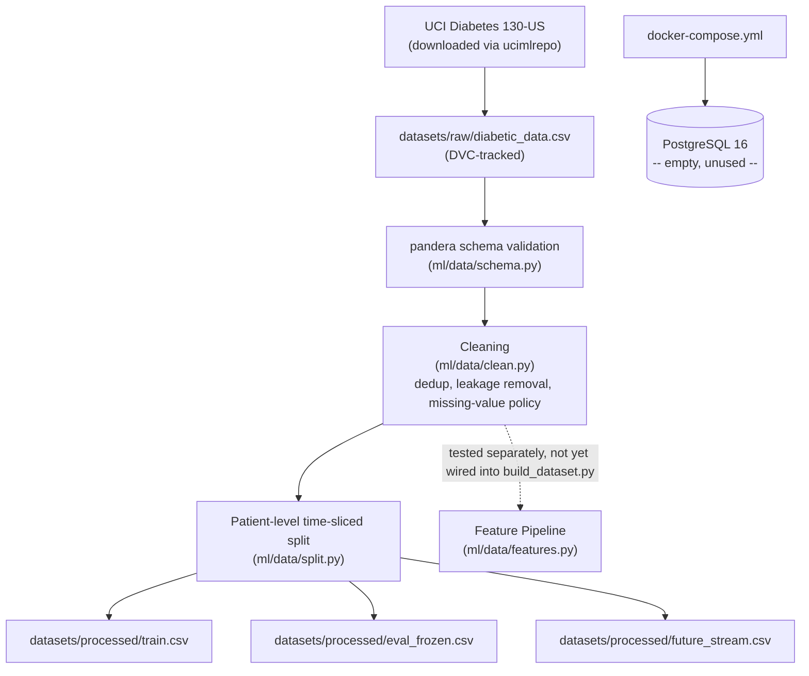
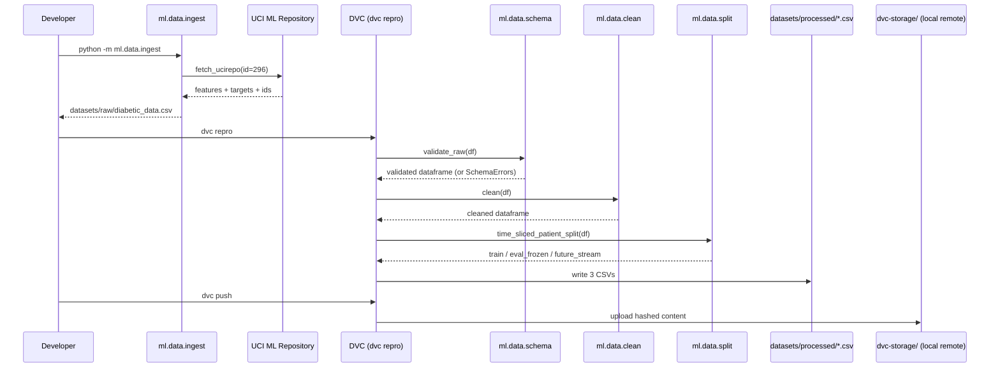

# VitalLoop 2.0 — Project Repository Guide

> **Scope of this document: Week 1 and Week 2 of the 12-week roadmap only.**
> Written for someone who has never seen this repository. Everything past Week 2 is explicitly marked **NOT IMPLEMENTED** in §11 — nothing beyond that boundary is described as done.

---

## 1. Project Introduction

**Purpose:** VitalLoop 2.0 predicts 30-day hospital readmission risk and, more importantly, *governs its own lifecycle* — it is designed to detect when its own predictions are degrading, decide (via deterministic rules, not an LLM) whether to retrain, prove a retrained challenger is actually better before promoting it, and leave a full audit trail. The complete design rationale lives in `project_docs/` — that directory is the project's **planning documentation**, produced before any code was written, and is treated as the source of truth for *intent*. This guide and `RUNNING_THE_PROJECT.md` are the **implementation documentation** — they describe what has actually been built.

**Goals:** reproducibility, testability, and auditability of a clinical model's retraining decisions — explicitly in place of an earlier design (v1) that used an LLM multi-agent system to make those decisions.

**Architecture (full target, per `project_docs/ARCHITECTURE.md`):** five planes — data, model, serving, self-healing loop, observation. **As of Week 2, only the data plane exists.** See §5 for what that means concretely.

**Current implementation milestone:** end of Week 2. Exit criteria met: `dvc repro` deterministically rebuilds the hashed dataset; the patient-level time-sliced split has a passing zero-leakage test.

**Project scope (12 weeks total):** this guide covers weeks 1–2 of 12. `project_docs/IMPLEMENTATION_ROADMAP.md` is the authority on the remaining ten weeks.

---

## 2. Repository Structure

```
MLOPS PROJECT/
├── .github/
│   └── workflows/
│       └── ci.yml                  # GitHub Actions: lint + test only (no training stage yet)
├── .dvc/                           # DVC internal config + cache pointers (not hand-edited)
├── .venv/                          # Python 3.12 virtual environment (gitignored, machine-local)
├── datasets/
│   ├── raw/
│   │   ├── diabetic_data.csv       # DVC-tracked raw data (gitignored; hash in .dvc file)
│   │   ├── diabetic_data.csv.dvc   # DVC pointer file (this IS committed to git)
│   │   └── .gitkeep
│   └── processed/
│       ├── train.csv               # DVC pipeline output (gitignored)
│       ├── eval_frozen.csv         # DVC pipeline output (gitignored)
│       ├── future_stream.csv       # DVC pipeline output (gitignored)
│       └── .gitkeep
├── docker/
│   └── docker-compose.yml          # PostgreSQL 16 only -- no other services defined yet
├── dvc-storage/                    # Local DVC remote (gitignored -- this machine's cache mirror)
├── ml/
│   ├── __init__.py
│   └── data/                       # The entire codebase as of Week 2 lives here
│       ├── __init__.py
│       ├── ingest.py                # Downloads the raw dataset from UCI
│       ├── schema.py                # pandera validation schema
│       ├── clean.py                 # Leakage removal, dedup, missing-value policy, target binarization + raw-target drop
│       ├── icd9.py                  # ICD-9 code -> clinical chapter mapping
│       ├── features.py              # The single sklearn Pipeline (train == serve transform)
│       ├── split.py                 # Patient-level, time-sliced train/eval/future split
│       └── build_dataset.py         # DVC pipeline entry point, ties the above together
├── notebooks/
│   └── 01_eda.ipynb                # Week 1 EDA + baseline model, executed with real output
├── tests/
│   ├── __init__.py
│   └── data/
│       ├── __init__.py
│       ├── test_schema.py
│       ├── test_clean.py
│       ├── test_features.py
│       └── test_split.py           # Contains the critical zero-leakage guard test
├── project_docs/                   # PRE-EXISTING planning/architecture documentation (not code)
│   ├── README.md
│   ├── PROJECT_DESIGN.md
│   ├── ARCHITECTURE.md
│   ├── TECH_STACK.md
│   ├── DATASET_ANALYSIS.md
│   ├── IMPLEMENTATION_ROADMAP.md
│   ├── WORKFLOW.md
│   ├── RISK_ANALYSIS.md
│   ├── RESEARCH_NOVELTY.md
│   ├── VITALLOOP_COMPLETE_DOCUMENTATION.md  # single-file merge of the above
│   ├── PROJECT_DESIGN.pdf
│   └── build_pdf.mjs               # Node script that renders PROJECT_DESIGN.md to PDF
├── docs/                           # THIS documentation set (implementation docs, not planning)
│   ├── RUNNING_THE_PROJECT.md
│   └── PROJECT_REPOSITORY_GUIDE.md
├── node_modules/                   # Pre-existing; only `marked`, used by build_pdf.mjs
├── models/                          # Fitted model bundle + run metadata (DVC outputs, gitignored)
├── reports/                         # Metrics, calibration table, SHAP tables, figures (DVC outputs;
│                                   #   reports/metrics.json is a git-tracked DVC metric)
├── dvc.yaml                        # DVC pipeline: build_dataset → train_model → evaluate_model → explain_model
├── dvc.lock                        # DVC's record of exact input/output hashes for the last run
├── pyproject.toml                  # ruff + pytest configuration
├── requirements.txt                # Week 1-2 direct dependencies (lower bounds)
├── constraints.txt                 # Exact pinned versions incl. transitive deps (generated)
└── .gitignore
```

**Folders that do not exist yet** (and why that's correct at Week 2, per `project_docs/ARCHITECTURE.md` §10's target structure): `api/`, `loop/`, `dashboard/`, `db/`, `scenarios/`, `configs/`, `scripts/`, `reports/`. Each belongs to a specific future week (see §6/§11) and has not been created — creating empty stub folders for unimplemented modules was deliberately avoided.

---

## 3. File-by-File Explanation

### `ml/data/ingest.py`
- **Purpose:** downloads the UCI Diabetes 130-US Hospitals dataset (id=296) via the `ucimlrepo` package.
- **Contains:** `download_diabetes_130()` — fetches features, target, and ID columns (`encounter_id`, `patient_nbr`, which `ucimlrepo` separates from `features` by design) and joins them into one CSV.
- **Dependencies:** `ucimlrepo`, `pandas`.
- **Used by:** run manually/once (`python -m ml.data.ingest`) to populate `datasets/raw/`; not part of the DVC pipeline itself (the raw file, once present, is a `dvc add`-tracked input).
- **Executes:** on demand, not automatically.
- **Status:** implemented, verified against the live UCI source (confirmed 101,766 × 50, matching `project_docs/DATASET_ANALYSIS.md`).

### `ml/data/schema.py`
- **Purpose:** pandera schema validating the raw CSV's structure before anything else touches it.
- **Contains:** `raw_diabetes_schema` (a `pandera.pandas.DataFrameSchema`), `MEDICATION_COLUMNS` (the 23 shared medication fields, built programmatically to avoid 23 near-duplicate field definitions), and `validate_raw(df)`.
- **Dependencies:** `pandera`.
- **Used by:** `ml/data/build_dataset.py`; unit-tested directly by `tests/data/test_schema.py`.
- **Executes:** every time the DVC pipeline runs.
- **Configuration details:** value domains (e.g. `gender ∈ {Female, Male, Unknown/Invalid}`) were read directly off the real downloaded data, not assumed.
- **Status:** implemented; validated against the full real dataset with zero errors.

### `ml/data/clean.py`
- **Purpose:** applies the four Week 2 cleaning policy decisions.
- **Contains:** `remove_leakage_discharges`, `deduplicate_patients`, `apply_missing_value_policy`, `binarize_target`, and `clean()` which composes all four in order.
- **Target contract:** `binarize_target` derives `readmitted_30d` and **drops the raw `readmitted` column**. Keeping both would be target leakage — `readmitted_30d` is a deterministic function of `readmitted`, so any "every column except the target" feature selection would score perfectly. `ml/data/features.py::split_features_target` is the supported X/y split and additionally excludes identifier columns.
- **Deduplication order:** `deduplicate_patients` sorts by `encounter_id` before `drop_duplicates(keep="first")`, so the retained encounter is the chronologically earliest one regardless of input row order. This reproduces the previous output exactly (verified: 0 of 71,518 patients affected) without depending on the UCI export's incidental row ordering.
- **Dependencies:** `pandas`.
- **Used by:** `ml/data/build_dataset.py`; unit-tested by `tests/data/test_clean.py`.
- **Status:** implemented; on the real dataset, removes 2,423 leakage rows and dedups 101,766 → 69,990 rows.

### `ml/data/icd9.py`
- **Purpose:** maps raw ICD-9 diagnosis codes (`diag_1`/`diag_2`/`diag_3`) to ~18 clinical chapter groups, with `diabetes` (250.xx) carved out as its own group given its clinical dominance in this dataset.
- **Contains:** `map_icd9_series_to_chapter(series)`, an internal range table (`_RANGE_CHAPTERS`), and handling for V-codes, E-codes, and missing/unrecognized codes.
- **Dependencies:** `pandas`.
- **Used by:** `ml/data/features.py`; unit-tested by `tests/data/test_features.py`.
- **Status:** implemented.

### `ml/data/features.py`
- **Purpose:** the **single** feature-transformation path used identically at training and (future) serving time, per `project_docs/ARCHITECTURE.md` §3.2's train/serve-skew-by-construction requirement.
- **Contains:** `FeatureEngineer` (a scikit-learn `TransformerMixin` adding `service_utilization`, `num_med_changes`, `insulin_changed`, `procedure_rate`, per-diagnosis ICD-9 chapters, and an admission-source risk group), `ADMISSION_SOURCE_GROUPS` (a lookup built from the dataset's published `IDs_mapping.csv` semantics), and `build_feature_pipeline()`, which returns an unfitted `sklearn.pipeline.Pipeline` combining `FeatureEngineer` with a `ColumnTransformer` (median-impute + scale numerics, ordinal-encode age bands, one-hot-encode the rest).
- **Dependencies:** `pandas`, `scikit-learn`, `ml.data.icd9`.
- **Used by:** `ml/data/build_dataset.py` does **not** call this (Week 2's DVC stage produces cleaned/split CSVs, not a fitted matrix). It is fitted by `ml/train.py` as the first step of the model pipeline, and exercised directly by `tests/data/test_features.py`, which confirms a `fit_transform` on one slice and `transform` on another produce identical output width (the train/serve-skew guard).
- **Status:** implemented, tested, and consumed by the Week 3 model — it is the only preprocessing path, fitted inside both the base pipeline and each calibration fold.

### `ml/data/split.py`
- **Purpose:** patient-level, time-sliced split into `train` / `eval_frozen` / `future_stream`, using `encounter_id` order as a chronology proxy (the dataset has no real timestamps, per `project_docs/DATASET_ANALYSIS.md`).
- **Contains:** `time_sliced_patient_split(df, train_frac=0.70, eval_frac=0.15)`, which raises `ValueError` if the input isn't already deduplicated to one row per patient.
- **Dependencies:** `pandas`.
- **Used by:** `ml/data/build_dataset.py`; unit-tested by `tests/data/test_split.py`, including the zero-leakage guard.
- **Status:** implemented; verified on the real cleaned dataset (48,993 / 10,498 / 10,499 rows, fully disjoint `patient_nbr` sets).

### `ml/data/build_dataset.py`
- **Purpose:** the DVC pipeline's entry point — the one script `dvc.yaml` actually runs.
- **Contains:** `build()`, which reads `datasets/raw/diabetic_data.csv`, validates it (`schema.validate_raw`), cleans it (`clean.clean`), splits it (`split.time_sliced_patient_split`), and writes the three processed CSVs.
- **Dependencies:** `pandas`, `ml.data.schema`, `ml.data.clean`, `ml.data.split`.
- **Used by:** invoked via `dvc repro`, never directly.
- **When it executes:** whenever `dvc repro` detects a changed dependency (the raw CSV or any of the four modules it imports).
- **Status:** implemented; confirmed idempotent (a second `dvc repro` reports "up to date").

### `notebooks/01_eda.ipynb`
- **Purpose:** Week 1's exploratory analysis and baseline model, in one executed notebook.
- **Contains (in order):** dataset load; target distribution (confirms ~11.16% positive rate); missingness analysis (confirms `weight` ~96.9% missing); leakage-candidate analysis (confirms 2,423 leakage rows, 23.45% of patients have >1 encounter); a written summary of the four cleaning decisions; a baseline `LogisticRegression` (patient-grouped 80/20 split, `StandardScaler` + median/constant imputation + one-hot encoding) achieving **AUROC 0.6191**.
- **Dependencies:** `pandas`, `scikit-learn`.
- **Status:** fully executed with real output (not just written and unrun).

### `ml/config.py`
- **Purpose:** Week 3 training configuration — artifact paths, the random seed, LightGBM parameters, calibration settings, threshold and subgroup choices.
- **Notable:** exposes **no** path constant for `future_stream.csv`, which is how the "reserved for Week 6" rule is enforced rather than merely documented.
- **Status:** implemented.

### `ml/train.py`
- **Purpose:** fits and persists the readmission model.
- **Contains:** `select_n_estimators` (early stopping on a chronological tail of the training slice), `build_base_model`, `build_calibrated_model`, `train_models`, `build_metadata`, `save_models`, `load_models`.
- **Produces:** `models/readmission_model.joblib` (a dict of `base_model` and `calibrated_model`) and `models/model_metadata.json`.
- **Design note:** the metadata file carries **no wall-clock timestamp** — it is a DVC stage output, and a timestamp would change its hash on every run. Run timing belongs to MLflow in Week 4.
- **Status:** implemented; trains on 48,993 rows, early stopping selects 82 trees.

### `ml/evaluate.py`
- **Purpose:** the metric suite on the frozen evaluation slice.
- **Contains:** `expected_calibration_error`, `recall_at_top_fraction`, `threshold_counts`, `top_decile_threshold`, `score_predictions`, `reliability_table`, `subgroup_metrics`, and a `main()` that writes the report artifacts.
- **Design note:** every function is a pure function over `(y_true, y_prob)`, which is what makes the metrics unit-testable against hand-computed cases — the same property Week 8's validation gate will need.
- **Status:** implemented.

### `ml/explain.py`
- **Purpose:** SHAP explanations that describe the exact matrix the model consumes.
- **Contains:** `transformed_feature_names`, `transform_features`, `build_explainer`, `sample_matrix`, `global_importance`, `explain_instance`, and a `main()` that writes the SHAP artifacts.
- **Design note:** explains the **uncalibrated** base model. TreeExplainer needs the tree ensemble itself, and isotonic calibration is a monotonic remap — it changes the probability, not the ranking or the relative feature contributions.
- **Status:** implemented; 249 transformed features.

### `docker/docker-compose.yml`
- **Purpose:** local PostgreSQL 16 instance.
- **Contains:** one service (`postgres`), credentials sourced from `docker/.env` (gitignored) via `${VAR}` substitution — `docker/.env.example` is the committed template — a named volume for persistence.
- **Status:** implemented and running; **empty** — no application connects to it yet.

### `dvc.yaml` / `dvc.lock`
- **Purpose:** `dvc.yaml` declares the one pipeline stage (`build_dataset`) with its dependencies and outputs; `dvc.lock` is DVC's auto-generated record of the exact hashes from the last successful run.
- **Status:** implemented; both files exist and are consistent with the current data.

### `tests/data/*.py`
- **Purpose:** 70 tests across schema, clean, features, split, the built processed datasets, and the Week 3 model/calibration/SHAP contracts.
- **The one worth calling out specifically:** `tests/data/test_split.py::test_split_produces_no_patient_overlap_across_any_pair_of_splits` — this is the exact unit test `project_docs/RISK_ANALYSIS.md` calls for ("killed by tests, not vigilance").
- **Status:** all 34 pass. `tests/data/test_processed_datasets.py` asserts the data contract against the real 69,990-row processed output directly (no raw target column, zero patient overlap, 70/15/15, no leakage dispositions); it skips automatically when the datasets have not been built, so CI stays green without the data.

### `pyproject.toml`
- **Purpose:** ruff configuration (line length 100, target Python 3.12, rule sets E/F/I/UP) and pytest configuration (`testpaths = ["tests"]`).
- **Status:** implemented; `ruff check .` currently reports zero issues.

### `requirements.txt` / `constraints.txt`
- **Purpose:** `requirements.txt` declares the direct dependencies (lower bounds, hand-maintained) for Week 1–2 only, and comments that later-week dependencies (LightGBM, MLflow, FastAPI, Evidently, Streamlit, etc.) are deliberately absent until their week arrives. `constraints.txt` pins the exact resolved versions of the full transitive set, so local and CI environments match.
- **Usage:** `pip install -r requirements.txt -c constraints.txt`. Regeneration steps are documented in the `constraints.txt` header and in `RUNNING_THE_PROJECT.md` §5.1.
- **Why constraints and not a lockfile:** a pip constraint pins a version only if something actually requires that package, so the Windows-captured set (which contains `pywin32`/`pywinpty`) works unchanged on `ubuntu-latest` CI.
- **Status:** implemented; installs cleanly into a Python 3.12 venv.

### `.github/workflows/ci.yml`
- **Purpose:** GitHub Actions job — checkout, set up Python 3.12, `pip install -r requirements.txt -c constraints.txt`, `ruff check .`, `ruff format --check .`, `pytest -q`.
- **Status:** implemented; the same commands (`ruff check .`, `ruff format --check .`, `pytest -q`) pass locally, but the workflow has **not yet been observed running on GitHub**.

### Files that do **not** exist (and should not be assumed): `main.py`, `server.py`, `app.py`, any `index.tsx`/frontend component, any `Dockerfile` beyond the Compose file, any `README.md` at the project root, any `db/` migration files. (`docker/.env.example` **does** exist and is committed; the `docker/.env` it is copied to is gitignored and must never be committed.) If any future document references these, treat that as describing planned, not current, state.

---

## 4. Module Breakdown

| Module | Purpose | Depends on | Input | Output | Status | Future integration |
|---|---|---|---|---|---|---|
| `ml/data/ingest.py` | Acquire raw data | `ucimlrepo` | UCI repo (network) | `datasets/raw/diabetic_data.csv` | Done | None needed — one-shot |
| `ml/data/schema.py` | Fail-fast validation | `pandera` | Raw dataframe | Validated dataframe or `SchemaErrors` | Done | Will also validate future mock-FHIR ingestion (Week 6+, not yet built) |
| `ml/data/clean.py` | Leakage-safe cleaning | `pandas` | Validated dataframe | Cleaned dataframe with `readmitted_30d` target; raw `readmitted` dropped | Done | Consumed unchanged by Week 3 training |
| `ml/data/icd9.py` | Diagnosis grouping | `pandas` | Raw ICD-9 code series | Chapter-label series | Done | — |
| `ml/data/features.py` | Train==serve transform | `scikit-learn`, `icd9.py` | Cleaned dataframe | Encoded numeric matrix (249 columns) | Done, consumed by `ml/train.py` | Week 5's FastAPI service will `transform` with the *same fitted instance* at inference time |
| `ml/data/split.py` | Leakage-free split | `pandas` | Cleaned, deduped dataframe | 3 dataframes (train/eval_frozen/future_stream) | Done | `future_stream` is reserved for the Week 6 seeded drift scenarios (not yet built) |
| `ml/data/build_dataset.py` | Pipeline orchestration | all of the above | Raw CSV path | 3 processed CSVs | Done | Week 3 added three further DVC stages downstream (`train_model`, `evaluate_model`, `explain_model`) |

---

## 5. Architecture Explanation

### What exists today (Week 2) — the entire current architecture:



There is no serving plane, no model plane beyond the notebook's baseline, no self-healing loop, and no observation plane yet. **Everything below the data plane in `project_docs/ARCHITECTURE.md`'s five-plane design is future work.**

### Full target architecture (for context — NOT current state)

The five-plane target (data → model → serving → self-healing loop → observation) is documented in full in `project_docs/ARCHITECTURE.md` §2. Reproducing that diagram here would misrepresent it as built; readers should go to that document for the target picture and treat everything in it beyond the data plane above as **not implemented**.

### Authentication, AI integration, storage flow, error handling, logging (as they exist today)
- **Authentication:** none exists (no API to authenticate against yet).
- **AI/LLM integration:** none exists (§7 of `RUNNING_THE_PROJECT.md`).
- **Storage flow:** raw CSV → local filesystem → DVC-hashed → local DVC remote (`dvc-storage/`). No cloud storage, no database-backed storage yet.
- **Error handling:** pandera raises `SchemaErrors` (collected, via `lazy=True`) on invalid input; `split.py` raises `ValueError` if given non-deduplicated data. No API-level error handling exists (no API).
- **Logging:** none implemented yet (structlog is planned for Week 5 alongside the FastAPI service).

---

## 6. Development Timeline (Weeks 1–3)

### Week 1 — Setup, EDA, Baseline

- **Objectives:** working environment; deep dataset understanding; an honest baseline number.
- **Completed work:** repo scaffold (ruff, pre-commit, CI stub); branch and commit conventions (documented in §12); Docker Compose skeleton (Postgres only); dataset downloaded and verified; EDA notebook executed; baseline model trained and evaluated.
- **Files created:** `.gitignore`, `requirements.txt`, `pyproject.toml`, `.pre-commit-config.yaml`, `.github/workflows/ci.yml`, `docker/docker-compose.yml`, `ml/data/ingest.py`, `notebooks/01_eda.ipynb`.
- **Modules completed:** dataset ingestion.
- **APIs completed:** none (none planned for Week 1).
- **Database work:** Postgres container provisioned; no schema.
- **Frontend work:** none (none planned).
- **Backend work:** none beyond the ingestion script.
- **AI/ML work:** baseline `LogisticRegression`, AUROC 0.6191.
- **Testing:** none yet at this point (testing infrastructure arrives with Week 2's modules).
- **Deliverables (per roadmap, both met):** `notebooks/01_eda.ipynb` with documented findings; `docker compose up` starts Postgres.

### Week 2 — Data Pipeline + DVC

- **Objectives:** reproducible, validated, versioned data.
- **Completed work:** pandera schema; cleaning module; sklearn feature pipeline; patient-level time-sliced split; DVC init with local remote; full unit test suite.
- **Files created:** `ml/data/schema.py`, `ml/data/clean.py`, `ml/data/icd9.py`, `ml/data/features.py`, `ml/data/split.py`, `ml/data/build_dataset.py`, `dvc.yaml`, `dvc.lock`, all of `tests/data/`.
- **Modules completed:** validation, cleaning, feature engineering (built and tested, not yet consumed by a model), splitting, DVC orchestration.
- **APIs completed:** none (Week 5).
- **Database work:** none beyond Week 1's empty container.
- **Frontend work:** none (Week 10).
- **Backend work:** the data pipeline itself is the "backend" work at this stage.
- **AI/ML work:** none new (feature pipeline is ML-adjacent infrastructure, not a model).
- **Testing:** 70 pytest tests, all passing; `ruff check .` and `ruff format --check .` clean.
- **Deliverables (per roadmap, both met):** `dvc repro` rebuilds the hashed dataset deterministically; documented, tested split strategy.

---

### Week 3 — Model, Calibration, Explainability

- **Objectives:** a calibrated readmission model, honestly evaluated, with explanations.
- **Completed work:** LightGBM classifier over the existing feature pipeline; isotonic calibration via 5-fold CV on the training slice; tree count selected by early stopping on a chronological training-slice tail; full metric suite on the frozen evaluation slice; SHAP global and local explanations; three new DVC stages.
- **Files created:** `ml/config.py`, `ml/train.py`, `ml/evaluate.py`, `ml/explain.py`, `tests/conftest.py`, `tests/test_train.py`, `tests/test_evaluate.py`, `tests/test_explain.py`, `tests/test_week3_artifacts.py`.
- **Modules completed:** model training, evaluation, explainability.
- **APIs completed:** none (Week 5).
- **Database work:** none — nothing writes to Postgres yet.
- **AI/ML work:** calibrated LightGBM; eval ROC-AUC 0.6024 calibrated / 0.5996 raw, Brier 0.0741, ECE 0.0201, recall@top-decile 0.171.
- **Testing:** 36 new tests (70 total), all passing.
- **Deliverables (per roadmap):** `ml/train.py`, `ml/evaluate.py`, metrics report, SHAP summary — all present.
- **Known gap:** ROC-AUC sits below the published 0.64–0.69 range, which those papers obtain on random splits without patient-level deduplication. See `RUNNING_THE_PROJECT.md` §13 for the like-for-like comparison and the open question this raises.


## 7. Current Implementation Status

| Area | Status | Approx. completion vs. full 12-week scope |
|---|---|---|
| Data ingestion | ✅ Completed | 100% of its own scope |
| Data validation (pandera) | ✅ Completed | 100% of its own scope |
| Data cleaning | ✅ Completed | 100% of its own scope |
| Feature engineering | ✅ Completed (built + tested) | Fitted in the Week 3 training run; 249 transformed features |
| Train/eval/future split | ✅ Completed | 100% of its own scope |
| Data versioning (DVC) | ✅ Completed | 100% of Week 2 scope; no remote sharing/team setup (not required yet) |
| Model training (LightGBM, calibration, SHAP) | ✅ Completed | Calibrated model in `models/`, metrics in `reports/metrics.json`, SHAP tables and figures in `reports/` |
| Experiment tracking (MLflow) | ⬜ Not started | 0% — Week 4 |
| API serving (FastAPI, JWT, audit rows) | ⬜ Not started | 0% — Week 5 |
| Drift monitoring (Evidently) | ⬜ Not started | 0% — Week 6 |
| Decision Engine + Decision Card | ⬜ Not started | 0% — Week 7 |
| Retrain pipeline + validation gate | ⬜ Not started | 0% — Week 8 |
| Shadow deployment, approval, LLM narration | ⬜ Not started | 0% — Week 9 |
| Dashboard (Streamlit) + audit PDF | ⬜ Not started | 0% — Week 10 |
| CI/CD hardening | 🟡 Partially completed | Basic lint+test CI exists; training smoke test, gate check, and image build stages are Week 11 |
| Report / viva prep | ⬜ Not started | 0% — Week 12 |

**Overall project completion: roughly 2 of 12 weeks (~17%) by roadmap time, concentrated entirely in the data plane.**

---

## 8. How Everything Connects



There is currently no request flow, no frontend-backend communication, and no AI integration to diagram — those all require components that don't exist yet (§11).

**Configuration flow today:** `pyproject.toml` configures ruff/pytest → read automatically by those tools. `dvc.yaml` configures the pipeline → read by `dvc repro`/`dvc push`/`dvc pull`. `docker-compose.yml` configures the Postgres container → read by `docker compose`. There is no central app config file yet (no `.env`, no `configs/` directory — both are future work).

---

## 9. Important Design Decisions

- **Why a single sklearn `Pipeline` for features (`ml/data/features.py`):** guarantees the exact same transformation at train and serve time by construction, per `project_docs/ARCHITECTURE.md` §3.2 — there is no second, hand-written "serving" transform to drift out of sync with training.
- **Why DVC with a local remote instead of S3:** matches the project's offline-first design goal (`project_docs/TECH_STACK.md`) and avoids cloud credentials for a project that must demo/run on a single machine.
- **Why patient-level, chronologically-ordered splitting (`ml/data/split.py`) instead of a random row-level split:** the dataset's own leakage trap (`project_docs/RISK_ANALYSIS.md`) is exactly a patient appearing in both train and eval; encounter order stands in for real time since the dataset has no timestamps, which is also what the (future) seeded drift benchmark depends on.
- **Why the 23 medication columns are generated programmatically in `schema.py` rather than written out by hand:** they share one value domain (`{No, Steady, Up, Down}`) — a dict comprehension is less error-prone and easier to keep in sync than 23 near-identical field declarations.
- **Why Python 3.12 instead of the machine's default 3.14:** at the time of this build, ML libraries (LightGBM, DVC, pandera, and later Evidently/MLflow) have more mature wheel support on 3.12; pinning the project venv avoids intermittent install failures on a bleeding-edge interpreter.
- **Why Gemini (`gemini-2.5-flash`) was selected for future LLM narration, and why Ollama/Llama 3.1 (as documented in `project_docs/ARCHITECTURE.md`/`TECH_STACK.md`) was not used:** this is a **project-level mandate**, not a decision derived from the planning documents — in fact it runs counter to them. The planning docs argue explicitly for a self-hosted, offline LLM specifically to avoid sending any metadata off-machine, given the system's PHI-adjacent posture. The Gemini mandate requires a cloud API instead. **This conflict is unresolved and flagged, not silently decided**, in `RUNNING_THE_PROJECT.md` §7. It has no effect on anything through Week 2, since no LLM code exists yet.
- **Why no `api/`, `db/`, `loop/`, `dashboard/` folders were pre-created:** avoids empty stub directories/files for functionality that doesn't exist yet; each is created when its week starts, per the roadmap's own week-by-week module boundaries.

---

## 10. Current Features

### Feature: Reproducible dataset versioning
- **Purpose:** guarantee that any Decision Card (future) or report can point to an exact, re-derivable dataset.
- **Workflow:** raw CSV → `dvc add` (hash) → `dvc.yaml` stage (`build_dataset`) → `dvc repro` → hashed processed outputs → `dvc push` to the local remote.
- **Files involved:** `datasets/raw/diabetic_data.csv.dvc`, `dvc.yaml`, `dvc.lock`, `ml/data/build_dataset.py`.
- **Status:** working; confirmed idempotent (a second `dvc repro` performs no work).
- **Limitations:** local remote only — no shared/team remote; no CI stage runs `dvc repro` yet.

### Feature: Schema-validated, leakage-free, patient-safe data cleaning
- **Purpose:** prevent the two leakage traps this dataset is known for (expired/hospice discharges; duplicate patients) from ever reaching a model.
- **Workflow:** raw → `validate_raw` → `clean` (leakage removal → chronological dedup → missing-value policy → target binarization with raw-target drop).
- **Files involved:** `ml/data/schema.py`, `ml/data/clean.py`, tested by `tests/data/test_schema.py` and `tests/data/test_clean.py`.
- **Status:** working; verified on the real dataset (69,990 rows survive cleaning from 101,766).
- **Limitations:** the missing-value policy is currently only defined for `weight` (dropped) and `payer_code`/`medical_specialty` (category-filled) — no policy yet for any other column, since none needed one per the Week 1 EDA.

### Feature: Train/serve-consistent feature engineering
- **Purpose:** eliminate training/serving skew by using one `Pipeline` object both times.
- **Workflow:** `FeatureEngineer` (adds engineered columns) → `ColumnTransformer` (impute/encode).
- **Files involved:** `ml/data/features.py`, `ml/data/icd9.py`, tested by `tests/data/test_features.py`.
- **Status:** built and unit-tested (confirmed identical output width on a `fit_transform` vs. `transform`-only call); **not yet used by an actual model** — there is nothing downstream consuming its output yet.

### Feature: Patient-level, zero-leakage, time-sliced splitting
- **Purpose:** hold out a chronologically later "future" segment for the eventual drift benchmark, without ever splitting a patient across segments.
- **Workflow:** sort by `encounter_id` → slice into 70/15/15 contiguous blocks.
- **Files involved:** `ml/data/split.py`, tested by `tests/data/test_split.py`.
- **Status:** working; the specific zero-overlap guard test passes both on synthetic fixtures and the real 69,990-row dataset.
- **Limitations:** the 70/15/15 split fractions are hardcoded defaults, not yet tuned against any downstream model performance (there is no model yet).

---

## 11. Pending Features — NOT IMPLEMENTED

Everything below is described only because it is planned in `project_docs/IMPLEMENTATION_ROADMAP.md`. **None of it exists in the repository today.** (Week 3 — the LightGBM model, isotonic calibration, SHAP explainability, and subgroup metrics — has since been implemented and is no longer listed.) It is listed here purely so a new developer knows what is coming and doesn't go looking for it.

- **Week 4 — NOT IMPLEMENTED:** MLflow tracking, model registry, champion/challenger/shadow aliases.
- **Week 5 — NOT IMPLEMENTED:** FastAPI service, JWT authentication, per-request audit rows, any database schema/tables/migrations.
- **Week 6 — NOT IMPLEMENTED:** Evidently drift monitoring, APScheduler worker, the seeded drift scenarios S1–S5.
- **Week 7 — NOT IMPLEMENTED:** the Decision Engine, the Decision Card schema/persistence, the confidence formula.
- **Week 8 — NOT IMPLEMENTED:** the retrain pipeline, the validation gate.
- **Week 9 — NOT IMPLEMENTED:** shadow deployment, human approval flow, **any LLM/Gemini narration integration whatsoever**.
- **Week 10 — NOT IMPLEMENTED:** the Streamlit dashboard, audit PDF export (fpdf2).
- **Week 11 — NOT IMPLEMENTED:** CI training smoke run, gate check stage, Docker image build stage, coverage gates beyond what exists today.
- **Week 12 — NOT IMPLEMENTED:** final report, benchmark result tables, demo video, tagged release.

If any other document (including AI-generated summaries) describes any of the above as done, that description is incorrect as of this repository's current state — treat this section as authoritative for "not yet built."

---

## 12. Repository Maintenance Guide

- **Where to add new data-pipeline logic:** `ml/data/` — follow the existing pattern of one focused module per concern (schema, clean, features, split), composed by `build_dataset.py`.
- **Where a future API will live:** `api/` (not yet created — create it when Week 5 starts, per `project_docs/ARCHITECTURE.md` §10).
- **Where model code lives:** `ml/train.py`, `ml/evaluate.py`, `ml/explain.py`, configured by `ml/config.py` (Week 3; implemented). Changing any of these re-runs the DVC model stages — commit the regenerated `dvc.lock` alongside the change.
- **Where new AI models/LLM clients will live:** `loop/narrate/` (Week 9; not yet created) — and must use `gemini-2.5-flash` per the project's mandatory constraint, with the offline-vs-cloud conflict (§9) resolved before writing that code.
- **Where configuration will live:** `configs/` (policy versions, gate criteria — not yet created, Week 7+); environment variables should go in a gitignored `.env` with a committed `.env.example`, created when the first component actually needs one (do not create ahead of need).
- **Branch conventions:** `main` is the only long-lived branch and must always be demoable — the roadmap's "Friday demo rule" (`project_docs/IMPLEMENTATION_ROADMAP.md`, Standing Rules). Work happens on short-lived branches named `week<N>/<topic>` (e.g. `week3/lightgbm-training`), or `fix/<topic>` for corrections outside the weekly cadence. Branches merge into `main` only with `ruff check .`, `ruff format --check .`, and `pytest -q` green; CI enforces the same three on every push and pull request. Delete the branch after merge.
- **Commit conventions:** Conventional-Commits style subject lines (`feat:`, `fix:`, `docs:`, `chore:`, `test:`), imperative mood, under ~72 characters, with a body explaining *why* rather than restating the diff. Commits that change `ml/data/schema.py`, `clean.py`, `split.py`, or `build_dataset.py` must include the regenerated `dvc.lock` in the **same** commit — those four files are DVC stage dependencies, so splitting them across commits leaves `main` in a state where `dvc status` is dirty on a fresh clone.
- **Naming conventions observed so far:** `snake_case` for modules and functions, one module per single responsibility, test files mirror source files 1:1 (`ml/data/clean.py` ↔ `tests/data/test_clean.py`).
- **Folder conventions:** mirror `project_docs/ARCHITECTURE.md` §10's target tree; do not create a folder before the week that needs it starts.
- **Coding conventions:** enforced by `ruff` (line length 100, rule sets E/F/I/UP) via `pyproject.toml` and the pre-commit hook; run `ruff check .` before committing.
- **Testing conventions:** `pytest`, tests live under `tests/`, mirroring the `ml/` structure; favor small synthetic fixtures for speed/determinism, with at least one cross-check against real data for anything safety-critical (as done for the leakage guard).

---

## 13. Developer Onboarding

**Where to begin:** read `project_docs/PROJECT_DESIGN.md` (or the PDF) end-to-end first — it's the complete story and the reading order the planning docs themselves recommend. Then `project_docs/ARCHITECTURE.md` + `project_docs/WORKFLOW.md`. Then this guide, for what's actually built. Then `RUNNING_THE_PROJECT.md` to get a working environment.

**What to read first (in order):**
1. `project_docs/PROJECT_DESIGN.md`
2. `project_docs/ARCHITECTURE.md`
3. `project_docs/IMPLEMENTATION_ROADMAP.md`
4. This file (`docs/PROJECT_REPOSITORY_GUIDE.md`)
5. `docs/RUNNING_THE_PROJECT.md`

**Development order:** follow the roadmap week-by-week; do not start Week 4 work before Week 3's model exists, since later weeks' components (MLflow registry, FastAPI serving) depend on artifacts earlier weeks produce.

**Best practices observed in this codebase so far:** one pure function/class per file per concern; validate at the boundary (schema) before transforming; write the leakage/skew-guard test *as part of* building the feature, not after; keep a real-data verification step, not just synthetic-fixture tests, for anything safety-critical.

**Common mistakes to avoid (each one was hit and fixed during this build):**
- Running `dvc repro` or `jupyter execute` without activating the project's venv first — it will silently use the system Python and fail on missing packages.
- Assuming `ucimlrepo`'s `dataset.data.features` includes `patient_nbr`/`encounter_id` — it does not; they're in `dataset.data.ids`.
- Forgetting that a broad `.gitignore` pattern like `datasets/raw/*` also hides DVC's own `.dvc` pointer file unless explicitly negated.
- On Windows, running notebook execution via a script without `PYTHONUTF8=1` if the notebook contains non-ASCII characters (em dashes, etc.) — `nbformat` will hit a `cp1252` decode error.

**Useful commands:**
```bash
source .venv/Scripts/activate       # every new shell
dvc repro                           # rebuild the dataset if inputs changed
dvc push / dvc pull                 # sync with the local remote
pytest -q                           # run all tests
ruff check .                        # lint
docker compose up -d                # (from docker/) start Postgres
```

**Debugging tips:** if `dvc repro` says "didn't change, skipping" but you expected it to rerun, check that you actually modified one of the declared `deps` in `dvc.yaml` — DVC only reruns a stage when its tracked dependencies' hashes change. If a pandera validation fails, `pandera.errors.SchemaErrors` (raised with `lazy=True`) collects *all* failures at once — read the full error, not just the first line.

---

## 14. Week 2 Summary Report

**✓ What has been achieved:**
A complete, tested, reproducible data foundation: dataset acquisition, schema validation, leakage-safe cleaning, single-path feature engineering, patient-level time-sliced splitting, and hash-pinned DVC versioning with a working local remote. A Week 1 baseline model (AUROC 0.6191) is documented and reproducible. 34/34 tests pass; linting and formatting are clean.

**✓ What is operational:**
`dvc repro` (idempotent), `dvc push`/`pull`, `pytest`, `ruff check .`, the executed EDA notebook, and a running (empty) PostgreSQL container.

**✓ What remains unfinished (by design, not oversight):**
Everything from Week 3 onward — model training, MLflow, the API, monitoring, the Decision Engine, the gate, shadow deployment, LLM narration, the dashboard, and full CI/CD. See §11 for the itemized list.

**✓ Known technical debt:**
- No git commits exist yet — the repository is initialized with everything staged/untracked.
- The offline-LLM-vs-Gemini-mandate conflict (§9) is identified but not resolved; it must be decided explicitly before Week 9 begins, not defaulted silently.
- `ml/data/features.py` is built and tested in isolation but has no real consumer yet — its correctness under an actual training run (with real target leakage/label alignment checks) can only be fully confirmed once Week 3 wires it into `ml/train.py`.

**Next milestones (FUTURE WORK — not started):**
- **Week 3:** LightGBM + isotonic calibration + SHAP + subgroup metrics — the first artifact that will actually consume `ml/data/features.py`'s output.
- **Week 4:** MLflow tracking and registry aliases.
- **Week 5:** FastAPI serving, JWT auth, the first real database schema.
