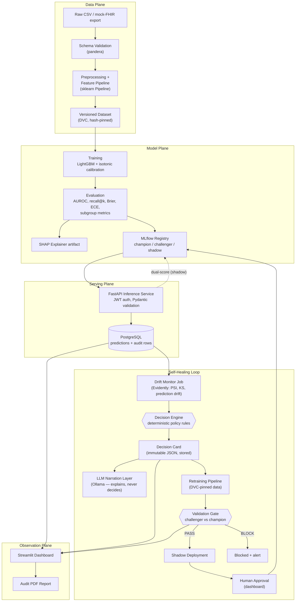
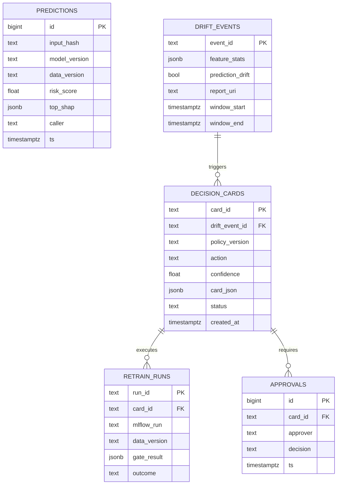
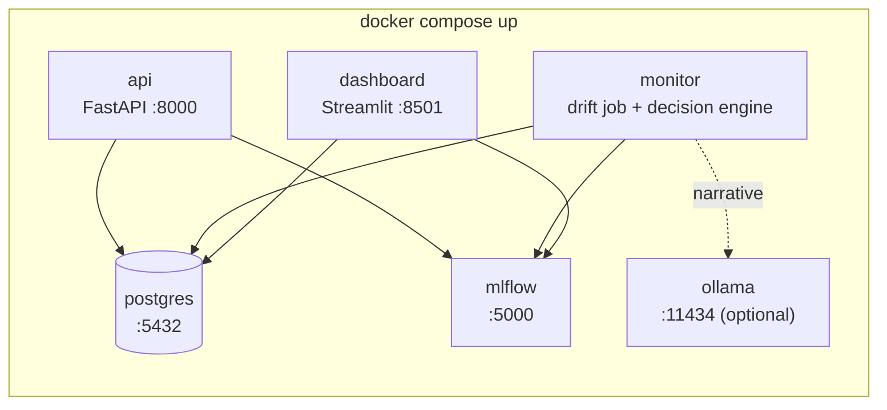

# VitalLoop 2.0 — System Architecture

> **Version 2.0** — redesigned from the original VitalLoop proposal after a full architectural review.
> Companion documents: [WORKFLOW.md](WORKFLOW.md) · [TECH_STACK.md](TECH_STACK.md) · [PROJECT_DESIGN.md](PROJECT_DESIGN.md)

---

## 1. Design Philosophy

VitalLoop 2.0 keeps the strongest ideas of v1 — the **Decision Card**, the **validation gate**, **shadow deployment**, and **human-gated promotion** — and removes the parts that added risk without adding value:

| v1 component | v2 decision | Reason |
|---|---|---|
| LangGraph 5-node multi-agent system | **Replaced** by a deterministic Decision Engine (pure Python) | Retraining decisions must be reproducible, unit-testable, and auditable. An LLM making the decision is none of these. |
| LLM self-consistency confidence score | **Replaced** by a deterministic confidence formula | A confidence number derived from sampling an LLM at temperature is not calibrated evidence; a weighted formula over measurable drift signals is. |
| React/Next.js + WebSockets frontend | **Replaced** by Streamlit | 3–4 weeks of UI work removed; the marks are in the loop, not the pixels. |
| AWS ECS / RDS stretch goal | **Dropped** (paper section only) | Docker Compose demonstrates the same architecture locally with zero cloud cost or credentials. |
| Guideline RAG | **Dropped** (future work) | Out of scope for a 12-week, 2-person project. |
| LLM (Ollama, Llama 3.1 8B) | **Retained, demoted** to a narration layer | It explains decisions in plain English; it never makes them. Falls back to Jinja2 templates if unavailable. |

**The core safety principle (v2):**

> *Deterministic code decides. The LLM only narrates. A human approves anything that touches clinicians.*

---

## 2. System Overview



---

## 3. Component Specifications

### 3.1 Ingestion & Validation

- **Input**: CSV export of the UCI Diabetes 130-US dataset, treated as a mock EHR extract. A small script optionally serves it via a mock-FHIR-style endpoint to show integration awareness.
- **Validation**: `pandera` schema — column types, allowed categorical values, null-rate ceilings, range checks (e.g., `time_in_hospital ∈ [1, 14]`). A batch that fails validation is quarantined and logged; it never reaches training or inference.
- **Why pandera and not Great Expectations**: same guarantees, a fraction of the setup and runtime weight, schemas live in code next to the pipeline.

### 3.2 Feature Pipeline

- A single `sklearn.pipeline.Pipeline` (imputation → encoding → engineered features) is **the only** transformation path — used identically at training and inference. This eliminates training/serving skew by construction.
- Engineered features: prior-utilization counts, medication-change flags, diagnosis groupings (ICD-9 chapter mapping), service-utilization index.
- Leakage controls: discharge dispositions indicating death/hospice are removed; `encounter_id`/`patient_nbr` deduplication keeps one encounter per patient.

### 3.3 Dataset Versioning (DVC)

- DVC with a **local remote** (a directory, or a Git-LFS-style shared folder). No S3 credentials, no cloud dependency, same reproducibility story: every training run records the DVC data hash in MLflow.
- Every Decision Card references the exact dataset hash a retrain will run on — the same guarantee v1 promised, delivered with less infrastructure.

### 3.4 Prediction Model

- **LightGBM** binary classifier (readmitted `<30` days vs not), wrapped in `CalibratedClassifierCV` (isotonic) so the output is a usable probability.
- **SHAP TreeExplainer** artifact stored with the model; the API returns the top-3 SHAP contributors per prediction.
- Metrics reported: AUROC, AUPRC, recall@top-decile, Brier score, expected calibration error (ECE), and all of these **per subgroup** (age band, gender, race).

### 3.5 Model Registry (MLflow)

- MLflow Tracking + Model Registry with three aliases: `champion` (serving), `challenger` (gate candidate), `shadow` (dual-scoring). Alias moves are the *only* way a model changes state, and every move writes an audit row.

### 3.6 Inference Service (FastAPI)

- Stateless FastAPI app. `POST /predict` → Pydantic-validated payload → pipeline transform → champion model → calibrated risk + top-3 SHAP factors.
- **JWT auth** on all endpoints; role claim (`clinician` / `ops`) gates the ops endpoints.
- **Per-request audit row** (PostgreSQL): SHA-256 hash of the input payload, model version, data version, score, top SHAP features, timestamp, caller identity. No raw PHI in logs — the hash allows later verification without storing the record twice.
- **Shadow scoring**: when a `shadow` alias exists, middleware also scores the request with the shadow model and logs it. The response *only ever* contains the champion score.

### 3.7 Drift Monitor

- A scheduled job (APScheduler inside a small worker container) runs **Evidently** every monitoring window (demo: every N minutes; design: daily):
  - **Input drift**: PSI and KS per feature vs the training reference.
  - **Prediction drift**: distribution shift of output scores.
  - **Performance (delayed)**: when 30-day labels mature, AUROC/recall on the labeled window.
- Results are written to `drift_events`; the full Evidently HTML report is stored as an artifact and linked from the dashboard.

### 3.8 Decision Engine — the core of v2

A pure-Python, fully unit-tested policy module. **No LLM, no randomness, no network.** Given a drift event it emits a Decision Card.

**Inputs**: latest drift event, drift history (persistence), label maturity, champion health metrics, time-since-last-retrain, retrain budget.

**Policy rule table (initial policy, versioned as `policy-v1`):**

| # | Condition | Action | Disposition |
|---|---|---|---|
| 1 | No feature PSI ≥ 0.10 and no prediction drift | `NO_OP` | — |
| 2 | 1–2 features with 0.10 ≤ PSI < 0.25, no prediction drift, first window | `ALERT_ONLY` | — |
| 3 | Same features breach for ≥ 2 consecutive windows | `INCREMENTAL_RETRAIN` | auto → shadow |
| 4 | Any feature PSI ≥ 0.25 **or** prediction drift detected | `FULL_RETRAIN` | auto → shadow if confidence ≥ 0.75, else escalate |
| 5 | Matured-label AUROC drop > 0.03 vs launch | `FULL_RETRAIN` | escalate to human (performance regression is never silent) |
| 6 | Retrained < X days ago **or** budget exhausted | downgrade to `ALERT_ONLY` | escalate |

**Confidence formula** (deterministic, calibrated against replayed scenarios):

```
confidence = w1·severity + w2·breadth + w3·persistence + w4·evidence
  severity    = min(max_PSI / 0.5, 1.0)
  breadth     = fraction of monitored features breaching PSI ≥ 0.10
  persistence = consecutive breaching windows / 3 (capped at 1)
  evidence    = 1.0 if matured labels confirm degradation,
                0.5 if only leading indicators (input/prediction drift)
  weights (policy-v1): w1=0.35, w2=0.20, w3=0.20, w4=0.25
```

Every policy version is a tagged code artifact; the Decision Card records which policy version produced it. Changing a threshold is a reviewed pull request — that *is* the governance story.

### 3.9 Decision Card (schema)

Immutable row in `decision_cards`, validated by a Pydantic model:

```json
{
  "card_id": "dc-2026-07-13-001",
  "created_at": "2026-07-13T10:42:00Z",
  "policy_version": "policy-v1.2",
  "trigger": {
    "drift_event_id": "de-0042",
    "breaching_features": [
      {"feature": "num_lab_procedures", "psi": 0.27, "ks_p": 0.001},
      {"feature": "num_medications", "psi": 0.19, "ks_p": 0.004}
    ],
    "prediction_drift": true,
    "label_maturity": "leading_indicators_only"
  },
  "action": "FULL_RETRAIN",
  "confidence": 0.86,
  "confidence_breakdown": {"severity": 0.54, "breadth": 0.18, "persistence": 0.67, "evidence": 0.5},
  "candidate_data_version": "dvc:9f3a1c...",
  "acceptance_criteria": {
    "auroc_non_inferiority_margin": 0.005,
    "recall_top_decile_min_ratio": 1.0,
    "max_ece": 0.05,
    "max_subgroup_auroc_drop": 0.01
  },
  "disposition": "AUTO_PROCEED_SHADOW",
  "narrative": "…LLM- or template-generated plain-English rationale…",
  "narrative_source": "ollama/llama3.1-8b",
  "status": "EXECUTED"
}
```

Everything v1 wanted the Decision Card to be — trigger, evidence, action, data version, acceptance criteria, confidence, disposition — is preserved. What changed is *who fills it in*: rules, not an LLM.

### 3.10 Narration Layer (the only LLM in the system)

- Local **Ollama** running Llama 3.1 8B. Input: the Decision Card JSON (aggregate statistics and metadata only — structurally incapable of seeing PHI). Output: a plain-English rationale paragraph and the narrative section of the audit report.
- A post-generation **grounding check** verifies every number quoted in the narrative appears in the card; a failed check falls back to the Jinja2 template.
- If Ollama is down, the Jinja2 template renders the narrative deterministically. The demo never depends on the LLM.

### 3.11 Retraining Pipeline

- The *same* training entry point used for the initial model, invoked with the DVC hash pinned in the Decision Card. Output: a `challenger` run in MLflow with full lineage (data hash, git commit, params, metrics).
- Demo acceleration: a cached-run replay mode re-registers a pre-trained challenger so the live demo completes in seconds (explicitly labeled as replay in the UI).

### 3.12 Validation Gate

Compares challenger vs champion on (a) a frozen holdout and (b) the most recent labeled window:

| Criterion | Rule |
|---|---|
| AUROC | challenger ≥ champion − 0.005 |
| Recall @ top decile | challenger ≥ champion |
| Brier score | challenger ≤ champion + 0.005 |
| Calibration (ECE) | ≤ 0.05 absolute |
| Subgroup non-regression | no subgroup AUROC drop > 0.01 (age, gender, race) |

`PASS` → challenger gets the `shadow` alias. `BLOCK` → card status set to `BLOCKED`, alert raised, nothing changes in serving. The gate is a pure function of two metric sets — trivially unit-testable, which is exactly what a promotion safety mechanism must be.

### 3.13 Shadow Deployment & Human Approval

- Shadow model dual-scores live traffic for a configured window (demo: K requests; design: N days). Dashboard shows score-agreement and stability statistics.
- Promotion to `champion` requires a **human click in the dashboard** (ops role), which writes an approval row (who, when, card reference). Autonomy stops at shadow — v1's best principle, kept verbatim.

### 3.14 Dashboard (Streamlit)

Pages: **Overview** (model health, versions, traffic) · **Drift Monitor** (Evidently panels) · **Decision Cards** (list + detail with narrative) · **Champion vs Challenger** (gate results) · **Approvals** (pending promotions, approve/reject) · **Audit** (searchable log + one-click PDF export via fpdf2).

---

## 4. Database Schema (PostgreSQL)



All five tables are append-only in application code (no UPDATE on card contents; status transitions append history rows), giving the immutable audit trail without database-level complexity.

---

## 5. Deployment Topology (Docker Compose)



- One `docker compose up` brings up the full system; `ollama` is an optional profile.
- CI (GitHub Actions): lint (ruff) → unit tests (pytest, incl. Decision Engine and gate) → training smoke run on a data sample → gate check → image build.

---

## 6. Security & PHI Posture

| Concern | Control |
|---|---|
| PHI in logs | Only SHA-256 input hashes and aggregate statistics are persisted outside the predictions store |
| PHI to the LLM | Structurally impossible — the narration layer receives only the Decision Card (aggregates + metadata); LLM is self-hosted |
| Unauthorized access | JWT with role claims; ops endpoints require `ops` role |
| Silent model swap | Alias change requires gate PASS + shadow window + logged human approval |
| Tampered decisions | Cards are append-only and reference immutable policy versions, data hashes, and MLflow runs |
