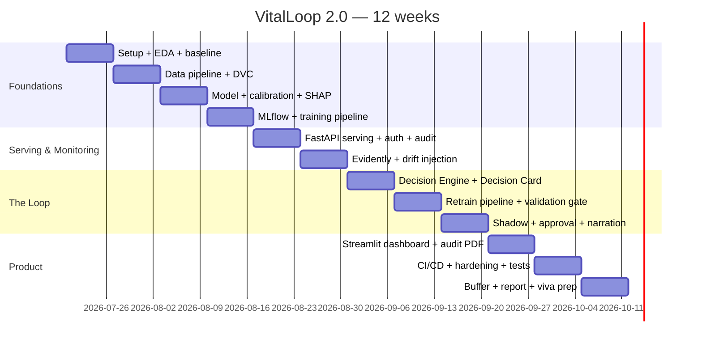

# VitalLoop 2.0 — 12-Week Implementation Roadmap

> Two engineers, ~12 weeks (10 core + 2 buffer). Student A leans data/ML, Student B leans backend/platform; both rotate through the loop components so either can defend any part at viva.
> Companion documents: [ARCHITECTURE.md](ARCHITECTURE.md) · [PROJECT_DESIGN.md](PROJECT_DESIGN.md)

## Milestone Map

---

## Week 1 — Setup, EDA, Baseline

- **Objectives**: working environment for both students; deep understanding of the dataset; honest baseline number.
- **Tasks**: repo + branch conventions + pre-commit (ruff); Docker Compose skeleton (postgres only); download UCI Diabetes 130; EDA notebook (missingness, imbalance, leakage candidates); logistic-regression baseline; **submit PhysioNet credentialing application** (free option for later).
- **Deliverables**: `notebooks/01_eda.ipynb`, baseline AUROC recorded, `docker compose up` starts Postgres.
- **Risks**: environment friction on Windows → standardize on Docker + devcontainer early.
- **Outcome**: both students can run everything; baseline ~0.62–0.65 AUROC documented.

## Week 2 — Data Pipeline + DVC

- **Objectives**: reproducible, validated, versioned data.
- **Tasks**: pandera schema; cleaning module (dedup, leakage-code removal, missing-value policy); sklearn feature `Pipeline`; DVC init with local remote; time-sliced holdout design (train / eval-frozen / "future" serving stream).
- **Deliverables**: `ml/data/` package with tests; `dvc repro` produces hashed dataset; documented split strategy.
- **Risks**: leakage subtleties (patient-level split!) → test asserting no `patient_nbr` overlap across splits.
- **Outcome**: one command rebuilds the exact dataset from raw CSV, hash-pinned.

## Week 3 — Model, Calibration, Explainability

- **Objectives**: the champion model, properly evaluated.
- **Tasks**: LightGBM + `CalibratedClassifierCV` (isotonic); metric suite (AUROC, AUPRC, recall@top-decile, Brier, ECE) overall + per subgroup (age/gender/race); SHAP TreeExplainer artifact; calibration-curve plots.
- **Deliverables**: `ml/train.py`, `ml/evaluate.py`, metrics report, SHAP summary plot.
- **Risks**: over-tuning to leaderboard-style AUROC → freeze eval set, cap tuning time to 1 day.
- **Outcome**: calibrated model at or above published benchmarks with subgroup metrics recorded.

## Week 4 — MLflow + Training Pipeline

- **Objectives**: every run tracked; registry with aliases operational.
- **Tasks**: MLflow in Compose; training logs params/metrics/git-commit/DVC-hash; registry aliases `champion`/`challenger`/`shadow`; promotion helper (`registry.py`) that writes an audit row on every alias move.
- **Deliverables**: registered champion v1; alias moves audited; MLflow UI reachable at :5000.
- **Risks**: MLflow artifact-store paths on Windows → run MLflow only inside Compose.
- **Outcome**: model lineage answers "which data and code produced the serving model" in one click.

## Week 5 — Serving API

- **Objectives**: secure, audited inference.
- **Tasks**: FastAPI `/predict` (Pydantic v2), champion loaded via alias; JWT auth + role claims; per-request audit row (input SHA-256, model+data version, score, top-3 SHAP, timestamp); structlog JSON logging; `TestClient` test suite.
- **Deliverables**: OpenAPI docs live; audit rows visible in Postgres; auth tests green.
- **Risks**: SHAP latency per request → precompute explainer, batch fallback, target < 200 ms.
- **Outcome**: end-to-end request → calibrated risk + explanation + audit row.

## Week 6 — Monitoring + Drift Injection

- **Objectives**: the system can see itself.
- **Tasks**: monitor worker (APScheduler) running Evidently per window (PSI/KS/prediction drift) vs training reference; `drift_events` persistence + report artifacts; **drift-injection scripts S1–S5** (see DATASET_ANALYSIS.md) with fixed seeds; hand-rolled PSI for 2 features as a cross-check test.
- **Deliverables**: injected drift produces a `drift_events` row and an Evidently report; no-drift control stays quiet.
- **Risks**: threshold tuning noise → calibrate PSI thresholds on the no-drift control week-6, not demo-day.
- **Outcome**: reproducible drift benchmark — the evaluation backbone of the whole project.

## Week 7 — Decision Engine + Decision Card ⭐

- **Objectives**: the core contribution: drift evidence → structured, auditable decision.
- **Tasks**: policy module (rule table from ARCHITECTURE.md §3.8); deterministic confidence formula; Pydantic Decision Card schema; `decision_cards` persistence; **exhaustive unit tests — every rule branch, every disposition**; policy versioning convention.
- **Deliverables**: all five drift scenarios S1–S5 produce the correct card (incl. `NO_OP` on control); ≥ 95% branch coverage on the engine.
- **Risks**: rule-table scope creep → freeze policy-v1 at 6 rules; improvements become policy-v2 (which itself demonstrates governance).
- **Outcome**: the examiner can read the policy as a table and re-derive any card by hand.

## Week 8 — Retraining + Validation Gate ⭐

- **Objectives**: close the loop; refuse regressions.
- **Tasks**: retrain trigger consuming a card (pinned DVC hash → challenger run); validation gate as a pure function over metric sets (non-inferiority, calibration ceiling, subgroup non-regression); `retrain_runs` + `gate_result` persistence; **deliberately-bad-challenger fixture** proving BLOCK; cached-run replay mode for fast demos.
- **Deliverables**: drift → card → retrain → gate PASS path fully automated; bad challenger BLOCKED with reasons.
- **Risks**: retrain wall-clock kills demos → replay mode is a first-class, labeled feature.
- **Outcome**: the money shot works: the system refuses to ship a worse model.

## Week 9 — Shadow, Approval, Narration

- **Objectives**: safe promotion + the LLM layer.
- **Tasks**: shadow dual-scoring middleware + agreement stats; approval flow (ops role) writing `approvals`; Ollama narration of Decision Cards + grounding check (every quoted number must exist in the card); Jinja2 fallback template; promotion moves `champion` alias.
- **Deliverables**: full lifecycle drift → … → shadow → human approval → promotion, every step persisted; narration works with and without Ollama.
- **Risks**: Ollama on lab machines → fallback is the default path in CI; LLM is demo-optional by design.
- **Outcome**: autonomy-with-restraint demonstrated end-to-end.

## Week 10 — Dashboard + Audit Report

- **Objectives**: make the loop visible.
- **Tasks**: Streamlit pages — Overview, Drift Monitor, Decision Cards (with narrative), Champion vs Challenger, Approvals, Audit; drift-injection button wired to S1/S2; fpdf2 audit-PDF export per card; polish the 3-minute demo path.
- **Deliverables**: complete demo clickable start-to-finish by someone who didn't build it.
- **Risks**: dashboard scope creep → 6 pages, no more; styling last.
- **Outcome**: the demo from WORKFLOW.md §5 runs in under 3 minutes.

## Week 11 — CI/CD, Hardening, Tests

- **Objectives**: production-inspired engineering evidence.
- **Tasks**: GitHub Actions — ruff → pytest → training smoke run (sampled data) → gate check → Docker build; Compose profiles (with/without ollama); seed script for a fresh-machine demo; test-coverage pass (engine + gate + API ≥ 80%); README quickstart verified on a clean machine.
- **Deliverables**: green pipeline badge; `docker compose up` + seed = working demo on a fresh clone.
- **Risks**: CI training time → 5k-row smoke sample, cached deps.
- **Outcome**: repo is examiner- and recruiter-ready.

## Week 12 — Buffer, Report, Viva Prep

- **Objectives**: absorb slippage; convert the build into marks.
- **Tasks**: final-year report (reuse PROJECT_DESIGN.md structure); results tables from the S1–S5 benchmark (detection latency, false-trigger rate, gate outcomes); demo video recording; viva Q&A drill — *why not LangGraph, why deterministic policy, why isotonic, how is PHI protected, what happens when the gate blocks*; freeze `v1.0` tag.
- **Deliverables**: report draft, demo video, tagged release.
- **Risks**: none new — this week exists to absorb the ones above.
- **Outcome**: submission-ready project with rehearsed defense.

---

## Standing Rules

- **Friday demo rule**: every week ends with the system demoable from `main` — no long-lived broken states.
- **Two-person redundancy**: the ⭐ weeks (7–8) are pair-programmed; both students must be able to explain the Decision Engine and gate unaided.
- **Scope valve**: if any week slips by more than 3 days, drop (in order): second-dataset exhibit → Ollama narration (template fallback ships) → mock-FHIR endpoint. **The loop itself is never cut.**
