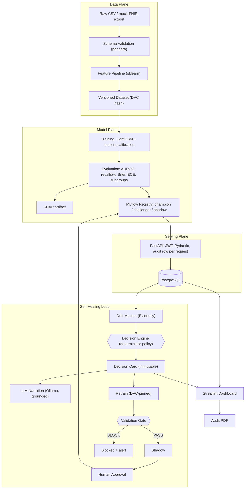
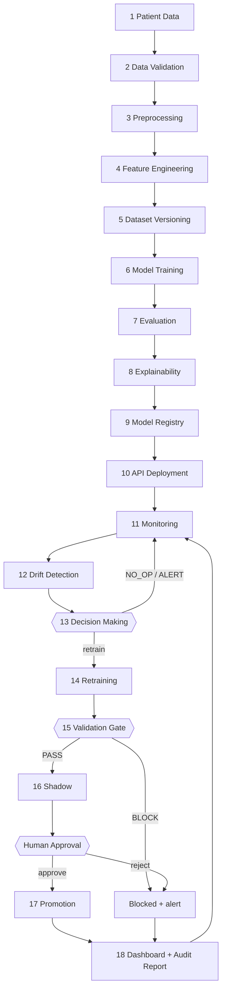

<div align="center">

# VitalLoop 2.0

## Self-Healing MLOps for Clinical Readmission Risk

### Technical Design Specification — Version 2.0

**A closed, audited, PHI-safe model lifecycle:**
*monitor → decide → retrain → gate → shadow → human-approved promotion*

| | |
|---|---|
| **Document type** | Architectural review of v1 + full redesign |
| **Domain** | Healthcare — 30-day hospital readmission risk |
| **Track** | MLOps — production ML lifecycle & governed retraining |
| **Team size / duration** | 2 engineering students · 12 weeks |
| **Core spine** | LightGBM · MLflow · DVC · Evidently · FastAPI · PostgreSQL · Streamlit · Docker |
| **Design principle** | *Deterministic code decides. The LLM only narrates. A human approves anything that touches clinicians.* |
| **Date** | July 2026 |

</div>

---

## Executive Summary

VitalLoop v1 proposed a self-healing MLOps loop for a clinical readmission model: detect drift, reason about it, retrain, gate the challenger, and promote safely — with an LLM multi-agent system (LangGraph) making the retrain decision. This document is a professional review of that proposal and a redesign derived from the problem statement rather than from the v1 implementation.

**The review's central finding:** v1's *governance ideas* are excellent — the Decision Card, the validation gate, shadow deployment, and human-gated promotion are exactly right. Its *mechanism* is inverted: it places an LLM in the control path, making the one decision that must be reproducible, testable, and auditable into the one component that is none of those things. The actual decision logic ("PSI over threshold on k features for w windows → retrain") is a truth table, not a reasoning problem.

**The redesign (v2.0)** keeps every governance idea and re-implements the decision as a **deterministic, versioned, unit-tested policy engine** that emits the Decision Card. The LLM (local Llama 3.1 via Ollama) is retained but demoted to a **narration layer**: it translates the structured card into plain English for clinicians and audit reports, with a grounding check that rejects any narrative quoting numbers absent from the card, and a template fallback so the system never depends on it. The React frontend is replaced by Streamlit, the AWS stretch goal by a fully offline Docker Compose stack, and the LLM-derived confidence score by a deterministic formula over measurable drift signals.

The result is smaller, safer, fully reproducible, achievable by two students in 12 weeks — and *more* research-worthy, because the decision/narration separation, the label-latency-aware policy, the fairness-blocking gate, and the seeded drift benchmark are each defensible contributions.

---

## Table of Contents

1. [The Problem](#1-the-problem)
2. [Review of the Existing (v1) Architecture](#2-review-of-the-existing-v1-architecture)
3. [Weakness Analysis — Summary](#3-weakness-analysis--summary)
4. [The Redesigned Architecture (v2.0)](#4-the-redesigned-architecture-v20)
5. [End-to-End Workflow](#5-end-to-end-workflow)
6. [AI Components](#6-ai-components)
7. [Dataset Analysis](#7-dataset-analysis)
8. [Technology Stack](#8-technology-stack)
9. [12-Week Implementation Roadmap](#9-12-week-implementation-roadmap)
10. [GitHub Repository Structure](#10-github-repository-structure)
11. [Research Contributions](#11-research-contributions)
12. [Risk Analysis](#12-risk-analysis)
13. [Final Recommendation](#13-final-recommendation)

---

## 1. The Problem

### 1.1 The engineering problem

Training a readmission model is a solved exercise; a competent student reaches a publishable AUROC in a week. The unsolved engineering problem is everything after launch day: **a deployed clinical model degrades silently**, and inside a health system the response still depends on four manual steps — someone must *notice* degradation, *diagnose* whether it warrants action, *retrain* on the right data version and prove the new model is better, and *promote* it without silently swapping a model clinicians depend on. Each step is performed by hand, on a hopeful schedule, or not at all. The engineering problem is closing that loop as a system.

### 1.2 The research problem

Automation alone is not the research problem — a cron job automates retraining and makes things *worse* (it retrains blindly and can promote regressions). The research problem is **governed autonomy**: how does a system decide *whether* to retrain, prove the decision was justified, refuse to ship a worse model, and leave an audit trail a regulator could reconstruct — all while the ground-truth labels needed to confirm degradation arrive 30 days late?

### 1.3 Why deployed clinical models degrade

- **Covariate drift**: the patient mix shifts — demographics, referral patterns, a new service line.
- **Coding/measurement drift**: ICD coding practices change; an EHR upgrade alters how a field is captured; a lab changes assay or units. The *world* didn't change, the *data representation* did — and the model can't tell the difference.
- **Concept drift**: the relationship between features and readmission itself changes — new discharge protocols, new drugs, a pandemic.
- **Prevalence shift**: the base rate of readmission moves, silently breaking calibrated probabilities even when ranking (AUROC) holds.
- **Upstream pipeline decay**: a renamed column, a new null pattern — mundane, and the most common in practice.

### 1.4 Why existing MLOps platforms don't solve it

Cloud suites (SageMaker, Vertex) provide the *building blocks* — pipelines, registries, monitors — but the **decide-whether-and-how-to-retrain step remains human glue**, and healthcare auditability is bring-your-own. Drift dashboards (Evidently and peers) stop at an alert: no decision, no action, no closed loop. Scheduled retraining closes the loop blindly, with no evidence, no gate, and no audit story. None of them produce a governance artifact that records *why* the system acted.

### 1.5 Healthcare-specific constraints

1. **PHI must never leak** — into logs, third-party APIs, or an LLM context window.
2. **Every prediction and every lifecycle action must be auditable** — who/what/why/when, reconstructable after the fact.
3. **No silent model swaps** — a clinical model change is a clinical event; a human must approve it with evidence in front of them.
4. **Labels are late by definition** — a 30-day readmission label matures 30 days after discharge, so the system must act responsibly on leading indicators.
5. **Fairness is a safety property** — drift is rarely uniform across subgroups; a retrain that helps the average and harms one group is a regression.

---

## 2. Review of the Existing (v1) Architecture

Each v1 component, evaluated on its own merits.

### 2.1 Decision Card — ✅ KEEP (the best idea in v1)

Turning "the model might be degrading" into a structured, machine-checkable artifact — trigger evidence, action, data version, acceptance criteria, confidence, disposition — is genuinely novel and maps directly onto emerging regulatory logging obligations. **Verdict: keep verbatim as a schema; change only who fills it in** (rules, not an LLM — see 2.2).

### 2.2 LangGraph Multi-Agent System — ❌ REMOVE

Five LLM-agent nodes (DriftAnalyst, DecisionMaker, RetrainOrchestrator, ValidationGate, Reporter) orchestrated as a state graph.

- **DriftAnalyst** "interprets" the Evidently report — but Evidently already outputs structured PSI/KS values; interpretation is a comparison against thresholds. No reasoning required.
- **DecisionMaker** decides retrain-or-not via LLM — this is the fatal flaw. The decision must be *reproducible* (same evidence → same decision), *testable* (assertable branches), and *auditable* ("the LLM decided" satisfies no examiner and no regulator). A local 8B model at non-zero temperature is none of these. The actual logic is a six-row rule table.
- **RetrainOrchestrator** launches a pipeline — that is a function call, not an agent.
- **ValidationGate** compares two metric sets — a pure function; putting an LLM near it adds only risk.
- **Reporter** writes the narrative — *this is the one node where an LLM genuinely helps*, and it survives into v2 as the narration layer.

**Verdict: remove the framework entirely.** One of five nodes did LLM-appropriate work; the other four wrapped deterministic operations in non-determinism. The replacement (≈200 lines of tested Python) is simpler, faster, offline, and *more* impressive to a technical examiner, because the team can defend every branch. Rejecting LangGraph with this reasoning is itself part of the project's contribution (§11, C2).

### 2.3 MLflow — ✅ KEEP

Tracking + registry + artifacts in one self-hostable service; registry aliases model champion/challenger/shadow natively. Correct choice, no serious alternative at this scope. Kept as-is.

### 2.4 DVC — ✅ KEEP, SIMPLIFY

Data versioning is essential — the Decision Card pins the exact dataset hash a retrain uses. But the proposed **S3 remote** adds AWS credentials, cost, and a network dependency to a system that must demo offline. **Verdict: keep DVC, use a local directory remote.** Identical reproducibility semantics, zero cloud surface.

### 2.5 Evidently — ✅ KEEP

PSI/KS per feature, prediction drift, and presentable HTML reports from one library. Correct. Supplemented with a hand-rolled PSI implementation for two features as a cross-check unit test — cheap insurance and good viva material.

### 2.6 FastAPI — ✅ KEEP

Async, Pydantic validation at the boundary, automatic OpenAPI docs. Industry standard for ML serving; nothing to improve at this scope.

### 2.7 PostgreSQL — ✅ KEEP

The audit story is relational lineage (`drift_events → decision_cards → retrain_runs → approvals`); JSONB holds card payloads. Correct choice. v2 adds the discipline that makes it an audit trail: **append-only in application code**.

### 2.8 Shadow Deployment — ✅ KEEP

Dual-scoring live traffic while clinicians see only the champion is the right safety mechanism and is cheap to build (middleware + one alias). Kept verbatim.

### 2.9 Validation Gate — ✅ KEEP, STRENGTHEN

v1's gate (AUC/recall + calibration + subgroup non-regression) is right. v2 makes it a **pure function** over two metric sets with explicit numeric criteria (AUROC non-inferiority margin 0.005, ECE ≤ 0.05, max subgroup AUROC drop 0.01) — trivially unit-testable, which is exactly what a promotion safety mechanism must be.

### 2.10 Human Approval — ✅ KEEP

"Autonomy stops at shadow; promotion needs gate-pass + audit-logged human approval" is v1's best principle. v2 keeps it and hardens it against rubber-stamping: the approval screen shows the full evidence chain, not a bare button.

### 2.11 Confidence Score — ⚠️ REPLACE THE MECHANISM

v1 derives confidence partly from **LLM self-consistency** (re-deriving the decision at non-zero temperature and measuring agreement). This measures the sampling stability of a language model, not the reliability of the evidence — and it is not reproducible. **Verdict: keep the concept, replace the mechanism** with a deterministic formula over measurable signals: drift severity, breadth, persistence, and evidence completeness (§4.3). Same number, now decomposable and re-derivable by hand.

### 2.12 Audit Trail — ✅ KEEP, SPECIFY

v1 promised immutability without specifying it. v2 specifies: append-only tables, cards referencing immutable policy versions + DVC hashes + MLflow run IDs, so cross-references make silent edits detectable.

### 2.13 LLM Reasoning — ⚠️ DEMOTE

The honest question: **is an LLM necessary? Not for any decision.** It is *valuable* for exactly one task — translating structured evidence into fluent English for clinicians and auditors. v2 keeps a local LLM for that task only, behind a grounding check, with a template fallback. See §6.9.

### 2.14 Other v1 elements

- **React/Next.js + WebSockets frontend** — ❌ replace with Streamlit: 3–4 weeks of UI toolchain work for two Python-leaning students, spent on the plane that earns no marks. Streamlit delivers every needed screen in days; auto-refresh replaces WebSockets.
- **AWS ECS/Fargate stretch** — ❌ drop from build scope; keep as a one-page mapping in future work. It adds cost and demo fragility while demonstrating nothing Compose doesn't.
- **Guideline RAG stretch** — ❌ drop; a second research project hiding inside the first.
- **Honest REAL vs MOCK framing, drift-injection demo, UCI Diabetes dataset choice** — ✅ keep; these were well judged.

---

## 3. Weakness Analysis — Summary

| # | v1 weakness | Consequence | v2 correction |
|---|---|---|---|
| W1 | LLM in the control path (DecisionMaker) | Non-reproducible, untestable, indefensible decisions | Deterministic Decision Engine; LLM narrates only |
| W2 | Agent framework wrapping deterministic steps | Complexity, latency, failure modes without benefit | Plain Python modules + Postgres rows as the contract |
| W3 | Confidence via LLM self-consistency | A vibe, not evidence | Deterministic 4-term confidence formula |
| W4 | React/WebSockets frontend | 3–4 of 12 weeks on UI | Streamlit (days, not weeks) |
| W5 | S3 remote + AWS stretch | Credentials, cost, online dependency | Local DVC remote; fully offline stack |
| W6 | Audit "immutability" unspecified | A claim, not a mechanism | Append-only discipline + cross-referenced immutable IDs |
| W7 | Thresholds/criteria implicit | Untunable, unexaminable | Versioned policy table + explicit gate numbers |
| W8 | RAG stretch goal | Scope risk | Cut |

---

## 4. The Redesigned Architecture (v2.0)

> Full component specifications: **ARCHITECTURE.md**. This section is the integrated view.

### 4.1 System overview



### 4.2 The Decision Engine (core of v2)

A pure-Python, versioned, exhaustively unit-tested policy module. No LLM, no randomness, no network. Policy-v1 rule table:

| # | Condition | Action | Disposition |
|---|---|---|---|
| 1 | No feature PSI ≥ 0.10, no prediction drift | `NO_OP` | — |
| 2 | 1–2 features 0.10 ≤ PSI < 0.25, first window | `ALERT_ONLY` | — |
| 3 | Same features breach ≥ 2 consecutive windows | `INCREMENTAL_RETRAIN` | auto → shadow |
| 4 | Any PSI ≥ 0.25 or prediction drift | `FULL_RETRAIN` | auto → shadow if confidence ≥ 0.75, else escalate |
| 5 | Matured-label AUROC drop > 0.03 | `FULL_RETRAIN` | **always escalate to human** |
| 6 | Recent retrain / budget exhausted | downgrade to `ALERT_ONLY` | escalate |

### 4.3 Deterministic confidence

```
confidence = 0.35·severity + 0.20·breadth + 0.20·persistence + 0.25·evidence
  severity    = min(max_PSI / 0.5, 1.0)
  breadth     = fraction of monitored features with PSI ≥ 0.10
  persistence = min(consecutive breaching windows / 3, 1.0)
  evidence    = 1.0 if matured labels confirm degradation, else 0.5
```

Decomposable, re-derivable by hand, and calibrated against the seeded scenario benchmark — everything the v1 self-consistency score was not.

### 4.4 The Decision Card (kept from v1, refilled by rules)

```json
{
  "card_id": "dc-2026-07-13-001",
  "policy_version": "policy-v1.2",
  "trigger": {
    "drift_event_id": "de-0042",
    "breaching_features": [
      {"feature": "num_lab_procedures", "psi": 0.27, "ks_p": 0.001},
      {"feature": "num_medications", "psi": 0.19, "ks_p": 0.004}
    ],
    "prediction_drift": true,
    "label_maturity": "leading_indicators_only"
  },
  "action": "FULL_RETRAIN",
  "confidence": 0.86,
  "confidence_breakdown": {"severity": 0.54, "breadth": 0.18, "persistence": 0.67, "evidence": 0.5},
  "candidate_data_version": "dvc:9f3a1c...",
  "acceptance_criteria": {
    "auroc_non_inferiority_margin": 0.005,
    "max_ece": 0.05,
    "max_subgroup_auroc_drop": 0.01
  },
  "disposition": "AUTO_PROCEED_SHADOW",
  "narrative_source": "ollama/llama3.1-8b",
  "status": "EXECUTED"
}
```

### 4.5 Validation gate criteria

| Criterion | Rule |
|---|---|
| AUROC | challenger ≥ champion − 0.005 |
| Recall @ top decile | challenger ≥ champion |
| Brier score | challenger ≤ champion + 0.005 |
| Calibration (ECE) | ≤ 0.05 |
| Subgroup non-regression | no age/gender/race subgroup AUROC drop > 0.01 |

PASS → shadow alias. BLOCK → card closed as `BLOCKED`, alert raised, serving untouched.

### 4.6 State model (PostgreSQL, append-only)

`predictions` (per-request audit) · `drift_events` · `decision_cards` · `retrain_runs` (+ gate results) · `approvals`. Relational lineage across these five tables *is* the audit trail: for any champion version, the full chain of evidence is one query.

### 4.7 Deployment

One `docker compose up`: `api` (FastAPI), `dashboard` (Streamlit), `mlflow`, `postgres`, `monitor` (Evidently + Decision Engine worker), `ollama` (optional profile). Fully offline. CI on GitHub Actions: ruff → pytest → training smoke run → gate check → image build.

---

## 5. End-to-End Workflow

> Full step-by-step detail, sequence diagram, and failure paths: **WORKFLOW.md**.



Key properties: silence is logged (`NO_OP` is a card, not an absence); noise is filtered by persistence (rule 3); confirmed performance regressions always reach a human (rule 5); the challenger cannot reach clinicians without gate PASS ∧ shadow window ∧ logged approval.

**Three-minute demo:** healthy dashboard → one-click drift injection → Decision Card renders with plain-English rationale → cached retrain replays → gate PASS → shadow → human approves → champion version changes live → re-run with a deliberately bad challenger → **gate BLOCK** → export the audit PDF for the blocked card.

---

## 6. AI Components

| Component | Choice | Role |
|---|---|---|
| Prediction model | LightGBM (binary, `<30`-day readmission) | The clinical prediction — GBMs remain the right tool for mid-size tabular data |
| Calibration | Isotonic (`CalibratedClassifierCV`) | A probability clinicians can act on; ECE is a *gate criterion* |
| Explainability | SHAP TreeExplainer | Per-prediction top-3 factors in the API; global summaries in reports |
| Drift detection | Evidently (PSI, KS, prediction drift) | Leading indicators before labels mature |
| Monitoring | APScheduler worker + Evidently + Postgres | The system's senses; every window persisted |
| Validation | pandera (schema) + validation gate (promotion) | Bad data quarantined; bad models blocked |
| Retraining strategy | Evidence-triggered (policy), never calendar-triggered | Full vs incremental chosen by rule table; budget-capped |
| Agent framework | **None** | Deliberately rejected — see §2.2; the rejection is part of the thesis |
| LLM | Ollama · Llama 3.1 8B — narration only | Plain-English rationale + audit narrative, grounded and fallback-protected |

**Alternatives considered:** XGBoost (equivalent to LightGBM — pick one); logistic regression (kept as the interpretable baseline); TabNet/deep tabular (worse at this scale, harder to explain); NannyML (strong performance estimation, weaker reporting); Platt scaling (fine, isotonic is better with 100k rows); API LLMs (better prose, but metadata leaves the box and the offline demo breaks — wrong trade).

### 6.9 Is an LLM actually necessary?

**No.** Every decision in VitalLoop 2.0 is deterministic, and the system is complete without any LLM — the Jinja2 template narrative proves it every CI run.

**Where it genuinely adds value:** one place — turning a Decision Card into language a clinician or auditor reads naturally ("Two lab-utilization features shifted sharply over two consecutive windows; prediction distribution moved with them; labels are not yet mature, so the retrain proceeds only to shadow"). That is a real LLM strength, it carries zero safety weight, and it keeps a defensible GenAI component for hackathon and viva narratives.

**Guardrails that make it defensible:** (1) input is the card only — aggregates and metadata, structurally no PHI; (2) self-hosted, offline; (3) a grounding check rejects narratives quoting numbers not present in the card; (4) template fallback; (5) every narrative labeled with its source. This "decides vs narrates" separation is contribution C2 (§11).

---

## 7. Dataset Analysis

> Full profiles, cleaning plans, and feature-engineering detail: **DATASET_ANALYSIS.md**. All links verified July 2026.

| Rank | Dataset | Access | Size | Role |
|---|---|---|---|---|
| 1 | **UCI Diabetes 130-US Hospitals (1999–2008)** — [link](https://archive.ics.uci.edu/dataset/296/diabetes+130-us+hospitals+for+years+1999-2008) | Open | 101,766 encounters · 47 features · target `readmitted` | **Primary** — train + serve |
| 2 | **MIMIC-IV Demo v2.2** — [link](https://physionet.org/content/mimic-iv-demo/) | Open | 100 patients, full EHR schema | Mock-FHIR ingestion realism |
| 3 | **eICU-CRD Demo v2.0.1** — [link](https://physionet.org/content/eicu-crd-demo/) | Open | ~2,500 ICU stays, 20 hospitals | Natural cross-site drift exhibit |
| 4 | **MIMIC-IV v3.1 (full)** — [link](https://physionet.org/content/mimiciv/) | Credentialed (CITI + DUA) | 65k+ ICU / 200k+ ED patients | Research extension (apply week 1, treat as bonus) |
| 5 | **Synthea** — [link](https://github.com/synthetichealth/synthea) | Open (generated) | Unlimited; native FHIR R4 | Controlled drift source + FHIR feed |
| 6 | **UCI Heart Failure Clinical Records** — [link](https://archive.ics.uci.edu/dataset/519/heart+failure+clinical+records) | Open | 299 rows · 12 features · `DEATH_EVENT` | "Same engine, second model" generalization exhibit |

**Primary-dataset essentials:** binarize `readmitted` to `<30` vs rest (~11% positive → AUPRC/recall@k as primary metrics); deduplicate to one encounter per patient (leakage); **drop expired/hospice discharge dispositions 11, 13, 14, 19, 20, 21** (these patients cannot be readmitted — the classic leakage trap); drop `weight` (~97% missing); missingness-as-category for `payer_code`/`medical_specialty`; ICD-9 → 18 chapter groups. Published benchmarks (~0.64–0.69 AUROC) make results defensible.

**Drift benchmark (S1–S5):** seeded, committed scripts — covariate shift (lab/medication counts), coding change (HbA1c re-mapping), prevalence shift (case-mix resampling), delayed-label decay (degraded holdout replay), and a no-drift control that must yield `NO_OP` cards. Every claimed detection is re-runnable.

---

## 8. Technology Stack

> Full rationale and alternatives per layer: **TECH_STACK.md**.

| Layer | Choice | One-line why |
|---|---|---|
| Frontend | **Streamlit** | Every needed screen in days; effort belongs in the loop |
| Backend | **FastAPI + Pydantic v2** | Typed contracts, async, OpenAPI for free |
| Database | **PostgreSQL 16** | Relational audit lineage + JSONB cards |
| Experiment tracking / registry | **MLflow (aliases)** | champion/challenger/shadow modeled natively |
| Data versioning | **DVC, local remote** | Hash-pinned datasets, zero cloud surface |
| Drift / monitoring | **Evidently** | PSI/KS/prediction drift + presentable reports |
| Data validation | **pandera** | Schema-as-code, fails fast |
| Model | **LightGBM + isotonic + SHAP** | Right tool for tabular clinical data, calibrated and explainable |
| Decision making | **Deterministic policy engine (pure Python)** | Reproducible, testable, auditable — the point of the project |
| LLM | **Ollama · Llama 3.1 8B (narration only)** | PHI-safe, offline, grounded, fallback-protected |
| Scheduling | **APScheduler** | One periodic job ≠ an orchestrator |
| Containerization | **Docker Compose** | One command, fully offline demo |
| CI/CD | **GitHub Actions** | lint → tests → smoke train → gate → build |
| Auth | **JWT + role claims** (clinician / ops) | Viewer ≠ promoter — governance in the token |
| Logging / reporting | **structlog (JSON) + fpdf2 audit PDFs** | No PHI in logs; pure-Python PDF (no native deps) |
| Cloud | **None (paper section)** | Maps 1:1 to ECS/Cloud Run + RDS later; building it now buys nothing |

---

## 9. 12-Week Implementation Roadmap

> Full weekly objectives/tasks/deliverables/risks: **IMPLEMENTATION_ROADMAP.md**.

| Week | Focus | Exit deliverable |
|---|---|---|
| 1 | Setup, EDA, baseline; PhysioNet application filed | Baseline AUROC documented; Compose skeleton runs |
| 2 | Data pipeline, pandera, DVC, split design | `dvc repro` rebuilds the hashed dataset; leakage tests green |
| 3 | LightGBM + calibration + SHAP + subgroup metrics | Champion-quality model at/above benchmark |
| 4 | MLflow tracking + registry aliases | Registered champion with full lineage |
| 5 | FastAPI serving, JWT, per-request audit rows | Live endpoint; audit rows in Postgres |
| 6 | Evidently monitor + seeded drift scenarios S1–S5 | Reproducible drift benchmark; thresholds calibrated on control |
| 7 ⭐ | **Decision Engine + Decision Card** | All 5 scenarios → correct cards; ≥95% branch coverage |
| 8 ⭐ | **Retrain pipeline + validation gate** | Auto path drift→card→retrain→PASS; bad challenger BLOCKED |
| 9 | Shadow, approval flow, LLM narration + grounding | Full lifecycle persisted end-to-end |
| 10 | Streamlit dashboard + audit PDF export | 3-minute demo clickable start-to-finish |
| 11 | CI/CD, hardening, coverage, clean-clone rehearsal | Green pipeline; fresh-machine demo works |
| 12 | Buffer, report, benchmark tables, viva drill | Tagged v1.0, report draft, demo video |

**Standing rules:** Friday demo rule (main always demoable); ⭐ weeks pair-programmed; scope valve drops (in order) second-dataset exhibit → LLM narration → mock-FHIR endpoint — **the loop is never cut**.

---

## 10. GitHub Repository Structure

```
vitalloop/
├── api/                  # FastAPI service: routers, auth, middleware (shadow scoring), schemas
├── ml/
│   ├── data/             # ingestion, pandera schemas, cleaning, feature pipeline
│   ├── train.py          # training entry point (initial + retrain — same code path)
│   ├── evaluate.py       # metric suite incl. subgroup metrics
│   └── explain.py        # SHAP artifact build + per-request explanation
├── loop/
│   ├── monitor/          # APScheduler worker, Evidently runs, drift_events persistence
│   ├── engine/           # Decision Engine: policy tables, confidence, card emission ⭐
│   ├── gate/             # validation gate (pure function) + criteria config
│   └── narrate/          # Ollama client, grounding check, Jinja2 fallback templates
├── dashboard/            # Streamlit pages: overview, drift, cards, gate, approvals, audit
├── db/                   # SQLAlchemy models, migrations, seed scripts
├── datasets/             # DVC-tracked data (raw/, processed/) — content in DVC, pointers in git
├── scenarios/            # seeded drift-injection scripts S1–S5 (the benchmark)
├── notebooks/            # EDA, calibration analysis, benchmark result tables
├── configs/              # policy-v*.yaml, gate criteria, monitoring windows, thresholds
├── docker/               # Dockerfiles + docker-compose.yml (+ ollama profile)
├── .github/workflows/    # CI: lint → tests → smoke train → gate check → build
├── tests/                # unit (engine, gate, pipeline, auth) + integration (loop e2e)
├── scripts/              # seed_demo.py, reset.py, replay_retrain.py
├── reports/              # generated audit PDFs, benchmark tables, figures
├── docs/                 # this documentation set + report assets
└── README.md             # quickstart: docker compose up → seeded demo
```

Why this layout: `loop/` makes the thesis visible in the tree — monitor/engine/gate/narrate as four separated concerns; `scenarios/` elevates the benchmark to a first-class citizen; `configs/` holds versioned policy files so governance changes are reviewable diffs; a flat two-level hierarchy keeps navigation obvious for examiners.

---

## 11. Research Contributions

> Full claims, related-work positioning, and evaluation plans: **RESEARCH_NOVELTY.md**.

1. **C1 — Decision Card as an auditable governance primitive**: drift response as a machine-checkable record (evidence, policy version, action, pinned data, acceptance criteria) — the artifact regulators are beginning to require and no mainstream tool produces.
2. **C2 — Separation of powers: deterministic policy decides, LLM narrates**: a named, reusable safety pattern for LLMs in regulated pipelines, with a grounding check giving it teeth; the deliberate inversion of v1 is itself the finding.
3. **C3 — Label-latency-aware drift response**: evidence completeness as an explicit policy term — leading indicators cap autonomy at shadow; matured-label regressions always escalate.
4. **C4 — Fairness as a hard promotion gate**: subgroup non-regression as an automated deployment veto inside the retraining loop, where silent fairness erosion actually happens.
5. **C5 — Autonomy with restraint**: a graduated ladder (observe → decide → retrain → shadow → human-gated promote) with machine-checkable preconditions per rung.
6. **C6 — A reproducible drift-response benchmark**: five seeded scenarios + closed-loop metrics (detection latency, false-trigger rate, gate precision) — evaluating *responses*, not just detectors.

Paper-shaped output (stretch): *"Decision Cards: Auditable Autonomy for Clinical Model Retraining"* — target ML4H or an MLOps/MLSys workshop.

---

## 12. Risk Analysis

> Full six-category register with severity/likelihood: **RISK_ANALYSIS.md**.

**Top five, actively managed weekly:**

| Risk | Why it matters | Mitigation |
|---|---|---|
| Scope overrun | The only project-killing risk | Scope valve with a fixed drop order; the loop is never cut |
| Data leakage (hospice/death discharges, duplicate patients) | Silently invalidates every reported number | Killed by unit tests, not vigilance |
| Threshold mis-tuning | Difference between a credible loop and one that cries wolf | Calibrated on the no-drift control (S5); persistence rule filters noise |
| Weeks 8–9 integration | Highest coupling of the build | Contracts frozen week 7; components talk only via Postgres rows + MLflow aliases |
| Demo fragility | One bad demo erases twelve good weeks | Fully offline stack; clean-clone rehearsal in week 11 |

**Structural safety properties (built-in, not process):** gate blocks regressions including subgroup regressions; PHI cannot reach the LLM (it only ever receives the card); no code path promotes to champion without gate PASS + shadow + logged approval; LLM narratives are grounding-checked and source-labeled.

---

## 13. Final Recommendation

**Build VitalLoop 2.0 exactly as specified here.** If I were building this today, this is the architecture — and these are the trades behind it:

- **Why**: the problem statement asks for *trustworthy autonomy*, and trust decomposes into reproducibility, testability, and auditability. Every v2 change (rules over agents, formula over self-consistency, Streamlit over React, offline over cloud) buys more of those three with less code.
- **Trade-offs accepted**: the demo loses the phrase "multi-agent system" (and gains "we rejected it, here's why" — the stronger viva position). Streamlit is less polished than React (and delivers three weeks back to the loop). No live cloud (and no credentials, cost, or demo-day network risk).
- **Expected performance**: model at published benchmark (~0.65–0.69 AUROC, calibrated, with subgroup reporting); drift detection within one monitoring window on S1–S3; zero false triggers on the control; gate demonstrably blocking a bad challenger; full audit chain reconstructable by SQL.
- **Simplicity vs complexity**: complexity is spent exactly once — on the Decision Engine + gate, the components that carry the thesis. Everything else is deliberately boring, which is what production-inspired means.
- **Scalability**: stateless API + registry + relational state maps 1:1 onto managed cloud (documented, not built); the loop generalizes to any tabular clinical model — demonstrated cheaply with the heart-failure exhibit.
- **Research value**: six defensible contributions (§11), each with an evaluation path, anchored by a reproducible benchmark.
- **Hackathon value**: the 3-minute closed-loop demo with a live BLOCK — judgement plus restraint, visibly.
- **Resume value**: "designed and shipped a governed, self-healing ML lifecycle — deterministic policy engine, fairness-blocking promotion gate, grounded LLM narration, full audit lineage, one-command deployment" — every noun demonstrable in the repo.

> **The one-sentence thesis:** *v1 asked "can an AI decide when to retrain?" — v2 answers the better question: "what must surround retraining so that no one has to trust anyone's judgement, including the AI's?"*

---

*VitalLoop 2.0 — the readmission model that monitors itself, justifies itself, retrains itself, and refuses to ship a worse version of itself — with a human holding the only key that matters.*
