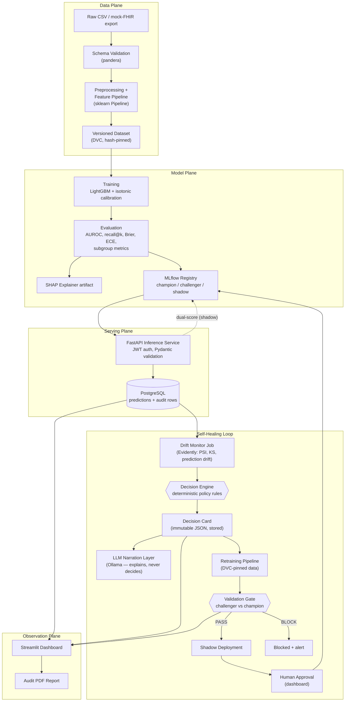
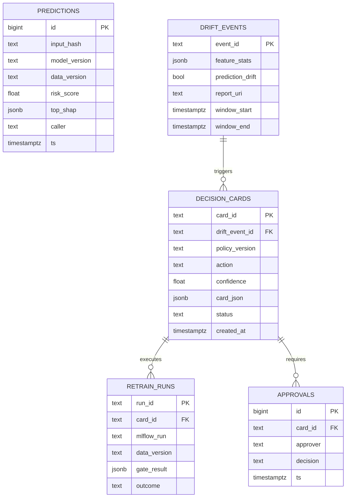
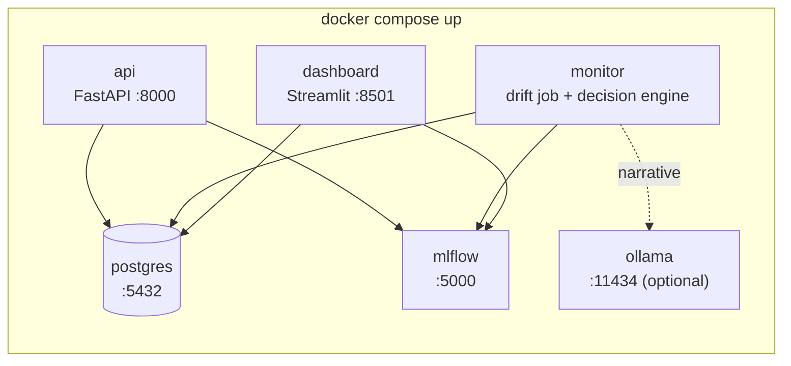
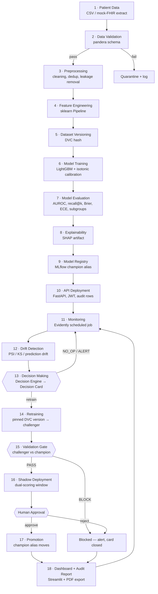
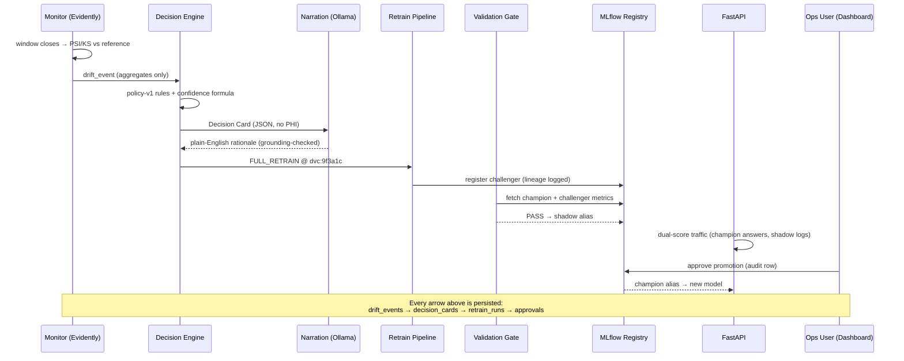
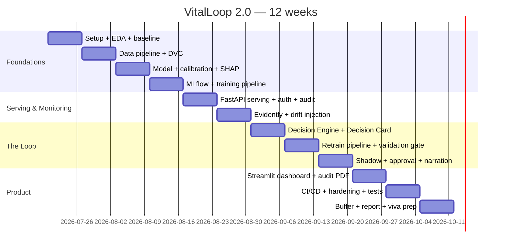

<div align="center">

# VitalLoop 2.0

## Self-Healing MLOps for Clinical Readmission Risk

### Technical Design Specification — Version 2.0

**Consolidated Single-File Edition — complete project documentation**

**A closed, audited, PHI-safe model lifecycle:**
*monitor → decide → retrain → gate → shadow → human-approved promotion*

| | |
|---|---|
| **Document type** | Architectural review of v1 + full redesign |
| **Domain** | Healthcare — 30-day hospital readmission risk |
| **Track** | MLOps — production ML lifecycle & governed retraining |
| **Team size / duration** | 2 engineering students · 12 weeks |
| **Core spine** | LightGBM · MLflow · DVC · Evidently · FastAPI · PostgreSQL · Streamlit · Docker |
| **Design principle** | *Deterministic code decides. The LLM only narrates. A human approves anything that touches clinicians.* |
| **Date** | July 2026 |

</div>

---

## Executive Summary

VitalLoop v1 proposed a self-healing MLOps loop for a clinical readmission model: detect drift, reason about it, retrain, gate the challenger, and promote safely — with an LLM multi-agent system (LangGraph) making the retrain decision. This document is a professional review of that proposal and a redesign derived from the problem statement rather than from the v1 implementation.

**The review's central finding:** v1's *governance ideas* are excellent — the Decision Card, the validation gate, shadow deployment, and human-gated promotion are exactly right. Its *mechanism* is inverted: it places an LLM in the control path, making the one decision that must be reproducible, testable, and auditable into the one component that is none of those things. The actual decision logic ("PSI over threshold on k features for w windows → retrain") is a truth table, not a reasoning problem.

**The redesign (v2.0)** keeps every governance idea and re-implements the decision as a **deterministic, versioned, unit-tested policy engine** that emits the Decision Card. The LLM (local Llama 3.1 via Ollama) is retained but demoted to a **narration layer**: it translates the structured card into plain English for clinicians and audit reports, with a grounding check that rejects any narrative quoting numbers absent from the card, and a template fallback so the system never depends on it. The React frontend is replaced by Streamlit, the AWS stretch goal by a fully offline Docker Compose stack, and the LLM-derived confidence score by a deterministic formula over measurable drift signals.

The result is smaller, safer, fully reproducible, achievable by two students in 12 weeks — and *more* research-worthy, because the decision/narration separation, the label-latency-aware policy, the fairness-blocking gate, and the seeded drift benchmark are each defensible contributions.

---

## Table of Contents

- [Executive Summary](#executive-summary)
- [Part I — The Problem](#part-i--the-problem)
- [Part II — Review of the Existing (v1) Architecture](#part-ii--review-of-the-existing-v1-architecture)
- [Part III — System Architecture (v2.0)](#part-iii--system-architecture-v20)
- [Part IV — End-to-End Workflow](#part-iv--end-to-end-workflow)
- [Part V — AI Components](#part-v--ai-components)
- [Part VI — Dataset Analysis](#part-vi--dataset-analysis)
- [Part VII — Technology Stack](#part-vii--technology-stack)
- [Part VIII — 12-Week Implementation Roadmap](#part-viii--12-week-implementation-roadmap)
- [Part IX — GitHub Repository Structure](#part-ix--github-repository-structure)
- [Part X — Research Novelty & Contributions](#part-x--research-novelty--contributions)
- [Part XI — Risk Analysis](#part-xi--risk-analysis)
- [Part XII — Final Recommendation](#part-xii--final-recommendation)
- [Appendix — Documentation Set & PDF Generation](#appendix--documentation-set--pdf-generation)

---

# Part I — The Problem

### 1.1 The engineering problem

Training a readmission model is a solved exercise; a competent student reaches a publishable AUROC in a week. The unsolved engineering problem is everything after launch day: **a deployed clinical model degrades silently**, and inside a health system the response still depends on four manual steps — someone must *notice* degradation, *diagnose* whether it warrants action, *retrain* on the right data version and prove the new model is better, and *promote* it without silently swapping a model clinicians depend on. Each step is performed by hand, on a hopeful schedule, or not at all. The engineering problem is closing that loop as a system.

### 1.2 The research problem

Automation alone is not the research problem — a cron job automates retraining and makes things *worse* (it retrains blindly and can promote regressions). The research problem is **governed autonomy**: how does a system decide *whether* to retrain, prove the decision was justified, refuse to ship a worse model, and leave an audit trail a regulator could reconstruct — all while the ground-truth labels needed to confirm degradation arrive 30 days late?

### 1.3 Why deployed clinical models degrade

- **Covariate drift**: the patient mix shifts — demographics, referral patterns, a new service line.
- **Coding/measurement drift**: ICD coding practices change; an EHR upgrade alters how a field is captured; a lab changes assay or units. The *world* didn't change, the *data representation* did — and the model can't tell the difference.
- **Concept drift**: the relationship between features and readmission itself changes — new discharge protocols, new drugs, a pandemic.
- **Prevalence shift**: the base rate of readmission moves, silently breaking calibrated probabilities even when ranking (AUROC) holds.
- **Upstream pipeline decay**: a renamed column, a new null pattern — mundane, and the most common in practice.

### 1.4 Why existing MLOps platforms don't solve it

Cloud suites (SageMaker, Vertex) provide the *building blocks* — pipelines, registries, monitors — but the **decide-whether-and-how-to-retrain step remains human glue**, and healthcare auditability is bring-your-own. Drift dashboards (Evidently and peers) stop at an alert: no decision, no action, no closed loop. Scheduled retraining closes the loop blindly, with no evidence, no gate, and no audit story. None of them produce a governance artifact that records *why* the system acted.

### 1.5 Healthcare-specific constraints

1. **PHI must never leak** — into logs, third-party APIs, or an LLM context window.
2. **Every prediction and every lifecycle action must be auditable** — who/what/why/when, reconstructable after the fact.
3. **No silent model swaps** — a clinical model change is a clinical event; a human must approve it with evidence in front of them.
4. **Labels are late by definition** — a 30-day readmission label matures 30 days after discharge, so the system must act responsibly on leading indicators.
5. **Fairness is a safety property** — drift is rarely uniform across subgroups; a retrain that helps the average and harms one group is a regression.

---

# Part II — Review of the Existing (v1) Architecture

Each v1 component, evaluated on its own merits.

### 2.1 Decision Card — ✅ KEEP (the best idea in v1)

Turning "the model might be degrading" into a structured, machine-checkable artifact — trigger evidence, action, data version, acceptance criteria, confidence, disposition — is genuinely novel and maps directly onto emerging regulatory logging obligations. **Verdict: keep verbatim as a schema; change only who fills it in** (rules, not an LLM — see 2.2).

### 2.2 LangGraph Multi-Agent System — ❌ REMOVE

Five LLM-agent nodes (DriftAnalyst, DecisionMaker, RetrainOrchestrator, ValidationGate, Reporter) orchestrated as a state graph.

- **DriftAnalyst** "interprets" the Evidently report — but Evidently already outputs structured PSI/KS values; interpretation is a comparison against thresholds. No reasoning required.
- **DecisionMaker** decides retrain-or-not via LLM — this is the fatal flaw. The decision must be *reproducible* (same evidence → same decision), *testable* (assertable branches), and *auditable* ("the LLM decided" satisfies no examiner and no regulator). A local 8B model at non-zero temperature is none of these. The actual logic is a six-row rule table.
- **RetrainOrchestrator** launches a pipeline — that is a function call, not an agent.
- **ValidationGate** compares two metric sets — a pure function; putting an LLM near it adds only risk.
- **Reporter** writes the narrative — *this is the one node where an LLM genuinely helps*, and it survives into v2 as the narration layer.

**Verdict: remove the framework entirely.** One of five nodes did LLM-appropriate work; the other four wrapped deterministic operations in non-determinism. The replacement (≈200 lines of tested Python) is simpler, faster, offline, and *more* impressive to a technical examiner, because the team can defend every branch. Rejecting LangGraph with this reasoning is itself part of the project's contribution (Part X, C2).

### 2.3 MLflow — ✅ KEEP

Tracking + registry + artifacts in one self-hostable service; registry aliases model champion/challenger/shadow natively. Correct choice, no serious alternative at this scope. Kept as-is.

### 2.4 DVC — ✅ KEEP, SIMPLIFY

Data versioning is essential — the Decision Card pins the exact dataset hash a retrain uses. But the proposed **S3 remote** adds AWS credentials, cost, and a network dependency to a system that must demo offline. **Verdict: keep DVC, use a local directory remote.** Identical reproducibility semantics, zero cloud surface.

### 2.5 Evidently — ✅ KEEP

PSI/KS per feature, prediction drift, and presentable HTML reports from one library. Correct. Supplemented with a hand-rolled PSI implementation for two features as a cross-check unit test — cheap insurance and good viva material.

### 2.6 FastAPI — ✅ KEEP

Async, Pydantic validation at the boundary, automatic OpenAPI docs. Industry standard for ML serving; nothing to improve at this scope.

### 2.7 PostgreSQL — ✅ KEEP

The audit story is relational lineage (`drift_events → decision_cards → retrain_runs → approvals`); JSONB holds card payloads. Correct choice. v2 adds the discipline that makes it an audit trail: **append-only in application code**.

### 2.8 Shadow Deployment — ✅ KEEP

Dual-scoring live traffic while clinicians see only the champion is the right safety mechanism and is cheap to build (middleware + one alias). Kept verbatim.

### 2.9 Validation Gate — ✅ KEEP, STRENGTHEN

v1's gate (AUC/recall + calibration + subgroup non-regression) is right. v2 makes it a **pure function** over two metric sets with explicit numeric criteria (AUROC non-inferiority margin 0.005, ECE ≤ 0.05, max subgroup AUROC drop 0.01) — trivially unit-testable, which is exactly what a promotion safety mechanism must be.

### 2.10 Human Approval — ✅ KEEP

"Autonomy stops at shadow; promotion needs gate-pass + audit-logged human approval" is v1's best principle. v2 keeps it and hardens it against rubber-stamping: the approval screen shows the full evidence chain, not a bare button.

### 2.11 Confidence Score — ⚠️ REPLACE THE MECHANISM

v1 derives confidence partly from **LLM self-consistency** (re-deriving the decision at non-zero temperature and measuring agreement). This measures the sampling stability of a language model, not the reliability of the evidence — and it is not reproducible. **Verdict: keep the concept, replace the mechanism** with a deterministic formula over measurable signals: drift severity, breadth, persistence, and evidence completeness (Part III, §3.8). Same number, now decomposable and re-derivable by hand.

### 2.12 Audit Trail — ✅ KEEP, SPECIFY

v1 promised immutability without specifying it. v2 specifies: append-only tables, cards referencing immutable policy versions + DVC hashes + MLflow run IDs, so cross-references make silent edits detectable.

### 2.13 LLM Reasoning — ⚠️ DEMOTE

The honest question: **is an LLM necessary? Not for any decision.** It is *valuable* for exactly one task — translating structured evidence into fluent English for clinicians and auditors. v2 keeps a local LLM for that task only, behind a grounding check, with a template fallback. See Part V, §6.9.

### 2.14 Other v1 elements

- **React/Next.js + WebSockets frontend** — ❌ replace with Streamlit: 3–4 weeks of UI toolchain work for two Python-leaning students, spent on the plane that earns no marks. Streamlit delivers every needed screen in days; auto-refresh replaces WebSockets.
- **AWS ECS/Fargate stretch** — ❌ drop from build scope; keep as a one-page mapping in future work. It adds cost and demo fragility while demonstrating nothing Compose doesn't.
- **Guideline RAG stretch** — ❌ drop; a second research project hiding inside the first.
- **Honest REAL vs MOCK framing, drift-injection demo, UCI Diabetes dataset choice** — ✅ keep; these were well judged.


## Weakness Analysis — Summary

| # | v1 weakness | Consequence | v2 correction |
|---|---|---|---|
| W1 | LLM in the control path (DecisionMaker) | Non-reproducible, untestable, indefensible decisions | Deterministic Decision Engine; LLM narrates only |
| W2 | Agent framework wrapping deterministic steps | Complexity, latency, failure modes without benefit | Plain Python modules + Postgres rows as the contract |
| W3 | Confidence via LLM self-consistency | A vibe, not evidence | Deterministic 4-term confidence formula |
| W4 | React/WebSockets frontend | 3–4 of 12 weeks on UI | Streamlit (days, not weeks) |
| W5 | S3 remote + AWS stretch | Credentials, cost, online dependency | Local DVC remote; fully offline stack |
| W6 | Audit "immutability" unspecified | A claim, not a mechanism | Append-only discipline + cross-referenced immutable IDs |
| W7 | Thresholds/criteria implicit | Untunable, unexaminable | Versioned policy table + explicit gate numbers |
| W8 | RAG stretch goal | Scope risk | Cut |

---

# Part III — System Architecture (v2.0)

> **Version 2.0** — redesigned from the original VitalLoop proposal after a full architectural review.

---

## 1. Design Philosophy

VitalLoop 2.0 keeps the strongest ideas of v1 — the **Decision Card**, the **validation gate**, **shadow deployment**, and **human-gated promotion** — and removes the parts that added risk without adding value:

| v1 component | v2 decision | Reason |
|---|---|---|
| LangGraph 5-node multi-agent system | **Replaced** by a deterministic Decision Engine (pure Python) | Retraining decisions must be reproducible, unit-testable, and auditable. An LLM making the decision is none of these. |
| LLM self-consistency confidence score | **Replaced** by a deterministic confidence formula | A confidence number derived from sampling an LLM at temperature is not calibrated evidence; a weighted formula over measurable drift signals is. |
| React/Next.js + WebSockets frontend | **Replaced** by Streamlit | 3–4 weeks of UI work removed; the marks are in the loop, not the pixels. |
| AWS ECS / RDS stretch goal | **Dropped** (paper section only) | Docker Compose demonstrates the same architecture locally with zero cloud cost or credentials. |
| Guideline RAG | **Dropped** (future work) | Out of scope for a 12-week, 2-person project. |
| LLM (Ollama, Llama 3.1 8B) | **Retained, demoted** to a narration layer | It explains decisions in plain English; it never makes them. Falls back to Jinja2 templates if unavailable. |

**The core safety principle (v2):**

> *Deterministic code decides. The LLM only narrates. A human approves anything that touches clinicians.*

---

## 2. System Overview



---

## 3. Component Specifications

### 3.1 Ingestion & Validation

- **Input**: CSV export of the UCI Diabetes 130-US dataset, treated as a mock EHR extract. A small script optionally serves it via a mock-FHIR-style endpoint to show integration awareness.
- **Validation**: `pandera` schema — column types, allowed categorical values, null-rate ceilings, range checks (e.g., `time_in_hospital ∈ [1, 14]`). A batch that fails validation is quarantined and logged; it never reaches training or inference.
- **Why pandera and not Great Expectations**: same guarantees, a fraction of the setup and runtime weight, schemas live in code next to the pipeline.

### 3.2 Feature Pipeline

- A single `sklearn.pipeline.Pipeline` (imputation → encoding → engineered features) is **the only** transformation path — used identically at training and inference. This eliminates training/serving skew by construction.
- Engineered features: prior-utilization counts, medication-change flags, diagnosis groupings (ICD-9 chapter mapping), service-utilization index.
- Leakage controls: discharge dispositions indicating death/hospice are removed; `encounter_id`/`patient_nbr` deduplication keeps one encounter per patient.

### 3.3 Dataset Versioning (DVC)

- DVC with a **local remote** (a directory, or a Git-LFS-style shared folder). No S3 credentials, no cloud dependency, same reproducibility story: every training run records the DVC data hash in MLflow.
- Every Decision Card references the exact dataset hash a retrain will run on — the same guarantee v1 promised, delivered with less infrastructure.

### 3.4 Prediction Model

- **LightGBM** binary classifier (readmitted `<30` days vs not), wrapped in `CalibratedClassifierCV` (isotonic) so the output is a usable probability.
- **SHAP TreeExplainer** artifact stored with the model; the API returns the top-3 SHAP contributors per prediction.
- Metrics reported: AUROC, AUPRC, recall@top-decile, Brier score, expected calibration error (ECE), and all of these **per subgroup** (age band, gender, race).

### 3.5 Model Registry (MLflow)

- MLflow Tracking + Model Registry with three aliases: `champion` (serving), `challenger` (gate candidate), `shadow` (dual-scoring). Alias moves are the *only* way a model changes state, and every move writes an audit row.

### 3.6 Inference Service (FastAPI)

- Stateless FastAPI app. `POST /predict` → Pydantic-validated payload → pipeline transform → champion model → calibrated risk + top-3 SHAP factors.
- **JWT auth** on all endpoints; role claim (`clinician` / `ops`) gates the ops endpoints.
- **Per-request audit row** (PostgreSQL): SHA-256 hash of the input payload, model version, data version, score, top SHAP features, timestamp, caller identity. No raw PHI in logs — the hash allows later verification without storing the record twice.
- **Shadow scoring**: when a `shadow` alias exists, middleware also scores the request with the shadow model and logs it. The response *only ever* contains the champion score.

### 3.7 Drift Monitor

- A scheduled job (APScheduler inside a small worker container) runs **Evidently** every monitoring window (demo: every N minutes; design: daily):
  - **Input drift**: PSI and KS per feature vs the training reference.
  - **Prediction drift**: distribution shift of output scores.
  - **Performance (delayed)**: when 30-day labels mature, AUROC/recall on the labeled window.
- Results are written to `drift_events`; the full Evidently HTML report is stored as an artifact and linked from the dashboard.

### 3.8 Decision Engine — the core of v2

A pure-Python, fully unit-tested policy module. **No LLM, no randomness, no network.** Given a drift event it emits a Decision Card.

**Inputs**: latest drift event, drift history (persistence), label maturity, champion health metrics, time-since-last-retrain, retrain budget.

**Policy rule table (initial policy, versioned as `policy-v1`):**

| # | Condition | Action | Disposition |
|---|---|---|---|
| 1 | No feature PSI ≥ 0.10 and no prediction drift | `NO_OP` | — |
| 2 | 1–2 features with 0.10 ≤ PSI < 0.25, no prediction drift, first window | `ALERT_ONLY` | — |
| 3 | Same features breach for ≥ 2 consecutive windows | `INCREMENTAL_RETRAIN` | auto → shadow |
| 4 | Any feature PSI ≥ 0.25 **or** prediction drift detected | `FULL_RETRAIN` | auto → shadow if confidence ≥ 0.75, else escalate |
| 5 | Matured-label AUROC drop > 0.03 vs launch | `FULL_RETRAIN` | escalate to human (performance regression is never silent) |
| 6 | Retrained < X days ago **or** budget exhausted | downgrade to `ALERT_ONLY` | escalate |

**Confidence formula** (deterministic, calibrated against replayed scenarios):

```
confidence = w1·severity + w2·breadth + w3·persistence + w4·evidence
  severity    = min(max_PSI / 0.5, 1.0)
  breadth     = fraction of monitored features breaching PSI ≥ 0.10
  persistence = consecutive breaching windows / 3 (capped at 1)
  evidence    = 1.0 if matured labels confirm degradation,
                0.5 if only leading indicators (input/prediction drift)
  weights (policy-v1): w1=0.35, w2=0.20, w3=0.20, w4=0.25
```

Every policy version is a tagged code artifact; the Decision Card records which policy version produced it. Changing a threshold is a reviewed pull request — that *is* the governance story.

### 3.9 Decision Card (schema)

Immutable row in `decision_cards`, validated by a Pydantic model:

```json
{
  "card_id": "dc-2026-07-13-001",
  "created_at": "2026-07-13T10:42:00Z",
  "policy_version": "policy-v1.2",
  "trigger": {
    "drift_event_id": "de-0042",
    "breaching_features": [
      {"feature": "num_lab_procedures", "psi": 0.27, "ks_p": 0.001},
      {"feature": "num_medications", "psi": 0.19, "ks_p": 0.004}
    ],
    "prediction_drift": true,
    "label_maturity": "leading_indicators_only"
  },
  "action": "FULL_RETRAIN",
  "confidence": 0.86,
  "confidence_breakdown": {"severity": 0.54, "breadth": 0.18, "persistence": 0.67, "evidence": 0.5},
  "candidate_data_version": "dvc:9f3a1c...",
  "acceptance_criteria": {
    "auroc_non_inferiority_margin": 0.005,
    "recall_top_decile_min_ratio": 1.0,
    "max_ece": 0.05,
    "max_subgroup_auroc_drop": 0.01
  },
  "disposition": "AUTO_PROCEED_SHADOW",
  "narrative": "…LLM- or template-generated plain-English rationale…",
  "narrative_source": "ollama/llama3.1-8b",
  "status": "EXECUTED"
}
```

Everything v1 wanted the Decision Card to be — trigger, evidence, action, data version, acceptance criteria, confidence, disposition — is preserved. What changed is *who fills it in*: rules, not an LLM.

### 3.10 Narration Layer (the only LLM in the system)

- Local **Ollama** running Llama 3.1 8B. Input: the Decision Card JSON (aggregate statistics and metadata only — structurally incapable of seeing PHI). Output: a plain-English rationale paragraph and the narrative section of the audit report.
- A post-generation **grounding check** verifies every number quoted in the narrative appears in the card; a failed check falls back to the Jinja2 template.
- If Ollama is down, the Jinja2 template renders the narrative deterministically. The demo never depends on the LLM.

### 3.11 Retraining Pipeline

- The *same* training entry point used for the initial model, invoked with the DVC hash pinned in the Decision Card. Output: a `challenger` run in MLflow with full lineage (data hash, git commit, params, metrics).
- Demo acceleration: a cached-run replay mode re-registers a pre-trained challenger so the live demo completes in seconds (explicitly labeled as replay in the UI).

### 3.12 Validation Gate

Compares challenger vs champion on (a) a frozen holdout and (b) the most recent labeled window:

| Criterion | Rule |
|---|---|
| AUROC | challenger ≥ champion − 0.005 |
| Recall @ top decile | challenger ≥ champion |
| Brier score | challenger ≤ champion + 0.005 |
| Calibration (ECE) | ≤ 0.05 absolute |
| Subgroup non-regression | no subgroup AUROC drop > 0.01 (age, gender, race) |

`PASS` → challenger gets the `shadow` alias. `BLOCK` → card status set to `BLOCKED`, alert raised, nothing changes in serving. The gate is a pure function of two metric sets — trivially unit-testable, which is exactly what a promotion safety mechanism must be.

### 3.13 Shadow Deployment & Human Approval

- Shadow model dual-scores live traffic for a configured window (demo: K requests; design: N days). Dashboard shows score-agreement and stability statistics.
- Promotion to `champion` requires a **human click in the dashboard** (ops role), which writes an approval row (who, when, card reference). Autonomy stops at shadow — v1's best principle, kept verbatim.

### 3.14 Dashboard (Streamlit)

Pages: **Overview** (model health, versions, traffic) · **Drift Monitor** (Evidently panels) · **Decision Cards** (list + detail with narrative) · **Champion vs Challenger** (gate results) · **Approvals** (pending promotions, approve/reject) · **Audit** (searchable log + one-click PDF export via fpdf2).

---

## 4. Database Schema (PostgreSQL)



All five tables are append-only in application code (no UPDATE on card contents; status transitions append history rows), giving the immutable audit trail without database-level complexity.

---

## 5. Deployment Topology (Docker Compose)



- One `docker compose up` brings up the full system; `ollama` is an optional profile.
- CI (GitHub Actions): lint (ruff) → unit tests (pytest, incl. Decision Engine and gate) → training smoke run on a data sample → gate check → image build.

---

## 6. Security & PHI Posture

| Concern | Control |
|---|---|
| PHI in logs | Only SHA-256 input hashes and aggregate statistics are persisted outside the predictions store |
| PHI to the LLM | Structurally impossible — the narration layer receives only the Decision Card (aggregates + metadata); LLM is self-hosted |
| Unauthorized access | JWT with role claims; ops endpoints require `ops` role |
| Silent model swap | Alias change requires gate PASS + shadow window + logged human approval |
| Tampered decisions | Cards are append-only and reference immutable policy versions, data hashes, and MLflow runs |

---

# Part IV — End-to-End Workflow

The workflow below is the complete lifecycle, from raw patient data to the audit report, exactly as the system executes it. Each numbered step names the component that owns it.

---

## 1. Master Flow



---

## 2. Step-by-Step

| # | Step | Owner | What happens | Key output |
|---|---|---|---|---|
| 1 | **Patient data** | Ingestion script | UCI Diabetes 130-US CSV lands as a mock EHR extract; optional mock-FHIR endpoint demonstrates integration shape | Raw batch |
| 2 | **Data validation** | pandera | Types, ranges, categorical domains, null ceilings. Failures quarantine the batch | Validated batch or quarantine record |
| 3 | **Preprocessing** | Feature pipeline | Deduplication (one encounter per patient), leakage removal (death/hospice discharge codes), missing-value strategy | Clean dataframe |
| 4 | **Feature engineering** | sklearn Pipeline | Encoding, ICD-9 chapter grouping, utilization counts, medication-change flags — one pipeline for train and serve | Feature matrix |
| 5 | **Dataset versioning** | DVC | `dvc add` produces the content hash that every downstream artifact references | `dvc:<hash>` |
| 6 | **Model training** | Training pipeline | LightGBM + isotonic calibration; params, data hash, git commit logged to MLflow | MLflow run |
| 7 | **Model evaluation** | Training pipeline | AUROC, AUPRC, recall@top-decile, Brier, ECE — overall and per subgroup (age/gender/race) | Metric set |
| 8 | **Explainability** | SHAP | TreeExplainer fitted and stored with the model; global summary + per-prediction top-3 | SHAP artifact |
| 9 | **Model registry** | MLflow | First model registered and given the `champion` alias | Registered version |
| 10 | **API deployment** | FastAPI | `/predict` serves calibrated risk + SHAP factors; JWT auth; every request writes an audit row (input hash, model + data version, score, timestamp) | Live endpoint |
| 11 | **Monitoring** | Monitor worker | Scheduled Evidently run over the rolling prediction window vs training reference | Drift report |
| 12 | **Drift detection** | Evidently | Per-feature PSI/KS, prediction-score drift; delayed-label performance when 30-day labels mature | `drift_events` row |
| 13 | **Decision making** | **Decision Engine** | Deterministic policy maps drift evidence → action (`NO_OP` / `ALERT_ONLY` / `INCREMENTAL_RETRAIN` / `FULL_RETRAIN`), confidence, disposition. Emits the **Decision Card**; LLM narration attached afterwards | Decision Card |
| 14 | **Retraining** | Retrain pipeline | Same training code, DVC hash pinned by the card; result registered as `challenger` | Challenger run |
| 15 | **Validation** | Validation Gate | Non-inferiority on AUROC/recall, calibration ceiling, subgroup non-regression. Pure function → PASS/BLOCK | Gate result |
| 16 | **Shadow deployment** | Serving middleware | Challenger dual-scores live traffic; agreement/stability stats accumulate; clinicians still see only champion | Shadow stats |
| 17 | **Deployment (promotion)** | Human + registry | Ops user approves in the dashboard; `champion` alias moves; approval row written | New champion |
| 18 | **Dashboard + audit report** | Streamlit | All of the above visible live; one click renders the CMS-style audit PDF for any Decision Card | Audit PDF |

---

## 3. The Self-Healing Loop as a Sequence



---

## 4. Failure Paths (designed, not incidental)

| Scenario | System behaviour |
|---|---|
| Drift below thresholds | `NO_OP` card — silence is also a logged, auditable decision |
| Noisy single-feature blip | `ALERT_ONLY`; persistence rule requires 2 consecutive windows before retraining |
| Challenger worse than champion | Gate **BLOCK** — card closed as `BLOCKED`, alert raised, serving untouched. *This is the demo's money shot.* |
| Ollama down | Jinja2 template narrative; loop proceeds identically |
| Ambiguous evidence (confidence < 0.75) | Disposition = `ESCALATE_HUMAN`; nothing retrains until an ops user acts |
| Performance regression on matured labels | Always escalates — performance drops are never auto-handled silently |

---

## 5. Demo Script (3 minutes)

1. Dashboard shows healthy champion; predictions flowing, each stamped with model + data version.
2. **Inject drift** (one button: scripted covariate shift on `num_lab_procedures` + `num_medications`).
3. Monitor fires → Decision Card renders: `FULL_RETRAIN`, confidence 0.86, auto-proceed → narrative panel explains why in plain English.
4. Retrain replays a cached run → challenger appears → **gate PASS** → shadow.
5. Approve promotion in the dashboard → champion version changes live.
6. Re-run with the deliberately bad challenger → **gate BLOCK** → export the audit PDF for the blocked card.

---

# Part V — AI Components

| Component | Choice | Role |
|---|---|---|
| Prediction model | LightGBM (binary, `<30`-day readmission) | The clinical prediction — GBMs remain the right tool for mid-size tabular data |
| Calibration | Isotonic (`CalibratedClassifierCV`) | A probability clinicians can act on; ECE is a *gate criterion* |
| Explainability | SHAP TreeExplainer | Per-prediction top-3 factors in the API; global summaries in reports |
| Drift detection | Evidently (PSI, KS, prediction drift) | Leading indicators before labels mature |
| Monitoring | APScheduler worker + Evidently + Postgres | The system's senses; every window persisted |
| Validation | pandera (schema) + validation gate (promotion) | Bad data quarantined; bad models blocked |
| Retraining strategy | Evidence-triggered (policy), never calendar-triggered | Full vs incremental chosen by rule table; budget-capped |
| Agent framework | **None** | Deliberately rejected — see §2.2; the rejection is part of the thesis |
| LLM | Ollama · Llama 3.1 8B — narration only | Plain-English rationale + audit narrative, grounded and fallback-protected |

**Alternatives considered:** XGBoost (equivalent to LightGBM — pick one); logistic regression (kept as the interpretable baseline); TabNet/deep tabular (worse at this scale, harder to explain); NannyML (strong performance estimation, weaker reporting); Platt scaling (fine, isotonic is better with 100k rows); API LLMs (better prose, but metadata leaves the box and the offline demo breaks — wrong trade).

### 6.9 Is an LLM actually necessary?

**No.** Every decision in VitalLoop 2.0 is deterministic, and the system is complete without any LLM — the Jinja2 template narrative proves it every CI run.

**Where it genuinely adds value:** one place — turning a Decision Card into language a clinician or auditor reads naturally ("Two lab-utilization features shifted sharply over two consecutive windows; prediction distribution moved with them; labels are not yet mature, so the retrain proceeds only to shadow"). That is a real LLM strength, it carries zero safety weight, and it keeps a defensible GenAI component for hackathon and viva narratives.

**Guardrails that make it defensible:** (1) input is the card only — aggregates and metadata, structurally no PHI; (2) self-hosted, offline; (3) a grounding check rejects narratives quoting numbers not present in the card; (4) template fallback; (5) every narrative labeled with its source. This "decides vs narrates" separation is contribution C2 (Part X).

---

# Part VI — Dataset Analysis

> All links verified live on 2026-07-13.

## Ranking Summary

| Rank | Dataset | Access | Size | Role in this project |
|---|---|---|---|---|
| 1 | **UCI Diabetes 130-US Hospitals (1999–2008)** | Open | 101,766 encounters | **Primary** — trains and serves the readmission model |
| 2 | **MIMIC-IV Clinical Database Demo v2.2** | Open | 100 patients | Secondary — realistic EHR structure for the mock-FHIR ingestion demo |
| 3 | **eICU-CRD Demo v2.0.1** | Open | ~2,500 ICU stays | Generalization evidence — "same engine, different hospital system" |
| 4 | **MIMIC-IV v3.1 (full)** | Credentialed (CITI training + DUA) | 65k+ ICU / 200k+ ED patients | Research extension — only if credentialing completes in time |
| 5 | **Synthea synthetic patients** | Open (generate locally) | Unlimited (generated) | Drift-injection source + native FHIR bundles for the ingestion demo |
| 6 | **UCI Heart Failure Clinical Records** | Open | 299 patients | Mini generalization demo — wrap a second model with the same loop |

**Decision: rank 1 is the build dataset.** It is the only open dataset with real hospital readmission labels at meaningful scale, and it is the standard benchmark for this exact task — reviewers can compare reported AUROC against published baselines (~0.64–0.69 for <30-day readmission).

---

## 1. UCI Diabetes 130-US Hospitals (PRIMARY)

- **Link**: https://archive.ics.uci.edu/dataset/296/diabetes+130-us+hospitals+for+years+1999-2008
- **Source**: UCI Machine Learning Repository (Strack et al., 2014, *BioMed Research International*)
- **Rows**: 101,766 inpatient encounters (diabetic patients, 130 US hospitals, 1999–2008)
- **Features**: 47 — demographics (race, gender, age bands), admission/discharge/source codes, `time_in_hospital`, lab and procedure counts, 23 medication columns, HbA1c and glucose results, prior utilization (outpatient/emergency/inpatient visits), 3 ICD-9 diagnosis codes
- **Target**: `readmitted` ∈ {`<30`, `>30`, `NO`} → binarized to **readmitted within 30 days vs not** (~11% positive)

**Advantages**
- Real hospital data, open license, exactly the 30-day readmission problem in the problem statement
- Large enough to hold out a time-sliced "future" segment for **honest drift simulation**
- Published benchmark results exist → defensible evaluation
- Rich categorical/count structure gives SHAP meaningful clinical features to surface

**Limitations**
- 1999–2008 vintage; ICD-9 not ICD-10 (acceptable — the project is about the *lifecycle*, not the era)
- Class imbalance (~11% positive) — evaluate with AUPRC/recall@k, not accuracy
- `weight` ~97% missing, `payer_code`/`medical_specialty` ~40–50% missing
- No timestamps beyond encounter ordering — drift windows must be constructed synthetically

**Cleaning requirements**
1. Deduplicate to one encounter per `patient_nbr` (first encounter) to prevent identity leakage across train/test
2. **Remove leakage**: drop encounters with discharge disposition = expired/hospice (11, 13, 14, 19, 20, 21) — these patients cannot be readmitted
3. Drop `weight`; treat `payer_code`/`medical_specialty` missingness as an explicit category
4. Map `?` to NaN; map ICD-9 `diag_1..3` to ~18 clinically meaningful chapter groups
5. Binarize target; document the `>30 → negative` choice

**Feature-engineering ideas**
- `service_utilization = number_outpatient + number_emergency + number_inpatient`
- Medication-change intensity: count of the 23 med columns with `Up`/`Down`; `insulin_changed` flag
- `num_med_changes`, `num_meds_prescribed`, per-day procedure rate (`num_procedures / time_in_hospital`)
- Age-band ordinal encoding; admission-source risk grouping (ER vs referral vs transfer)
- **Drift-injection features**: shift `num_lab_procedures` distribution (+20%), re-map a fraction of HbA1c values to simulate a coding-practice change — the two scripted demo scenarios

---

## 2. MIMIC-IV Clinical Database Demo v2.2

- **Link**: https://physionet.org/content/mimic-iv-demo/
- **Source**: PhysioNet / MIT-LCP (Beth Israel Deaconess Medical Center)
- **Rows**: 100 patients (full relational EHR: admissions, diagnoses, labs, prescriptions)
- **Features**: dozens of linked tables mirroring the full MIMIC-IV schema (`hosp` + `icu` modules)
- **Target**: constructible — 30-day readmission from `admissions` (admit/discharge timestamps per subject)

**Advantages**: open access; the *real* structure of a modern EHR — ideal source for the mock-FHIR ingestion demo and for showing the pipeline generalizes beyond a flat CSV.
**Limitations**: 100 patients — far too small to train on; demo/structural use only.
**Cleaning**: join `admissions`+`patients`+`diagnoses_icd`; derive readmission gaps; ICD-9/10 mixed coding.
**FE ideas**: prior-admission counts, length-of-stay, Charlson comorbidity index from ICD codes.

## 3. eICU Collaborative Research Database Demo v2.0.1

- **Link**: https://physionet.org/content/eicu-crd-demo/
- **Source**: PhysioNet (Philips eICU program, 2014–2015, ~20 hospitals)
- **Rows**: ~2,500 ICU stays; CSV (130 MB) + SQLite
- **Target**: constructible — ICU readmission or hospital mortality

**Advantages**: open; **multi-hospital** — the natural dataset for demonstrating cross-site distribution shift (train on subset A of hospitals, monitor on subset B → genuine covariate drift, not synthetic).
**Limitations**: ICU population differs from general inpatient; demo subset is modest.
**Cleaning**: unit harmonization across hospitals; missing-value patterns differ by site (itself a drift story).
**FE ideas**: APACHE-derived severity features; site indicator held out as the drift axis.

## 4. MIMIC-IV v3.1 (full)

- **Link**: https://physionet.org/content/mimiciv/ (DOI: 10.13026/kpb9-mt58)
- **Source**: PhysioNet — **credentialed**: CITI "Data or Specimens Only Research" training + signed DUA (typically 1–3 weeks turnaround)
- **Rows**: 65k+ ICU patients, 200k+ ED patients, 2008–2022
- **Target**: 30-day readmission constructible with real calendar time — enabling **real temporal drift** (pre/post-COVID case mix, ICD-9→10 transition)

**Advantages**: the strongest possible research extension — actual temporal drift instead of injected drift would materially strengthen a paper.
**Limitations**: credentialing latency and data-handling obligations; too risky as the primary plan for a 12-week project. **Start the credentialing application in week 1; treat as a bonus.**

## 5. Synthea (synthetic patients)

- **Link**: https://github.com/synthetichealth/synthea (generator; releases include prebuilt sample sets)
- **Source**: MITRE — open-source synthetic patient generator
- **Rows**: unlimited — generate on demand; outputs **FHIR R4 bundles**, CSV, C-CDA
- **Target**: synthetic encounters/conditions allow a constructed readmission label

**Advantages**: zero PHI by construction; native FHIR output makes it the perfect feed for the mock-FHIR ingestion endpoint; module parameters can be changed between batches to generate *controlled, explainable* drift.
**Limitations**: synthetic correlations are weaker than real data — models trained on it look unrealistically clean; use for ingestion + drift demos, never for headline metrics.

## 6. UCI Heart Failure Clinical Records

- **Link**: https://archive.ics.uci.edu/dataset/519/heart+failure+clinical+records
- **Source**: UCI ML Repository (Chicco & Jurman, 2020)
- **Rows**: 299 · **Features**: 12 clinical (ejection fraction, serum creatinine, age, …) · **Target**: `DEATH_EVENT` during follow-up

**Advantages**: tiny and clean — ideal for the "the same engine wraps any tabular clinical model" claim: register a second model in the same registry, monitored by the same loop, in under a day.
**Limitations**: 299 rows — a toy; different target (mortality, not readmission). Positioning: generalization exhibit, one paragraph and one dashboard tab.

---

## Drift Simulation Plan (applies to the primary dataset)

Because dataset 1 lacks calendar timestamps, drift is **scripted and reproducible** — which is a feature, not a hack: it becomes the project's evaluation benchmark.

| Scenario | Mechanism | What it simulates |
|---|---|---|
| S1 Covariate shift | Shift `num_lab_procedures`, `num_medications` distributions in the serving stream | New hospital protocol / EHR upgrade |
| S2 Coding change | Re-map a fraction of HbA1c categories | The diabetes coding-practice change from the v1 demo story |
| S3 Prevalence shift | Resample serving stream to raise elderly + high-utilization mix | Population/case-mix drift |
| S4 Label drift (delayed) | Replay a labeled holdout with degraded relationship | Performance decay visible only after 30-day label maturity |
| S5 No-drift control | Untouched stream | Proves the engine does **not** cry wolf (`NO_OP` cards) |

Each scenario is a seeded script committed to the repo — reviewers can re-run every claimed detection.

---

# Part VII — Technology Stack

> Every choice below was re-derived from the problem statement, not inherited from v1.

## Stack at a Glance

| Layer | Technology | v1 proposed | Verdict |
|---|---|---|---|
| Frontend / Dashboard | **Streamlit** | React/Next.js + WebSockets | Changed — 3–4 weeks saved |
| Backend / API | **FastAPI + Pydantic v2** | FastAPI | Kept |
| Database | **PostgreSQL 16** | PostgreSQL | Kept |
| Experiment tracking | **MLflow** | MLflow | Kept |
| Model registry | **MLflow Registry (aliases)** | MLflow | Kept |
| Data versioning | **DVC (local remote)** | DVC + S3 | Simplified |
| Monitoring / drift | **Evidently** | Evidently | Kept |
| Data validation | **pandera** | Evidently + pandera | Kept (pandera for schema, Evidently for drift) |
| Model | **LightGBM + sklearn calibration + SHAP** | LightGBM/XGBoost + SHAP | Kept (LightGBM fixed as primary) |
| Decision making | **Deterministic Decision Engine (pure Python)** | LangGraph multi-agent LLM | **Replaced** |
| Reasoning framework | *(none — not needed)* | LangGraph | **Removed** |
| LLM | **Ollama + Llama 3.1 8B — narration only** | Ollama Llama 3.1 8B (decision-maker) | Kept, demoted |
| Scheduling | **APScheduler** (in monitor worker) | — (unspecified) | Added |
| Containerization | **Docker + Docker Compose** | Docker Compose | Kept |
| CI/CD | **GitHub Actions** | GitHub Actions | Kept |
| Authentication | **JWT (PyJWT) + role claims** | JWT | Kept |
| Logging | **structlog (JSON) + Postgres audit rows** | unspecified | Specified |
| Reporting | **fpdf2** (audit PDF) + Evidently HTML | "CMS-style PDF" | Specified |
| Testing | **pytest + ruff** | unspecified | Specified |
| Cloud | **None (design section only)** | AWS ECS/Fargate stretch | Dropped from build scope |

---

## Layer-by-Layer Rationale

### Frontend — Streamlit

- **Why**: Python-native; every dashboard page (drift panels, Decision Card viewer, champion-vs-challenger, approvals, audit log) is buildable in hours, not weeks. The team's effort belongs in the loop, which is what gets judged and examined.
- **Advantages**: zero JS toolchain; direct read of Postgres/MLflow; `st.button` gives human-in-the-loop approval for free; auto-refresh replaces WebSockets.
- **Alternatives**: React/Next.js (better polish, ~3–4 weeks cost — stretch only); Dash (heavier callbacks model); Gradio (too form-oriented for a monitoring UI).

### Backend — FastAPI + Pydantic v2

- **Why**: async, typed request validation at the boundary, automatic OpenAPI docs (excellent for viva), industry standard for ML serving.
- **Advantages**: Pydantic schema = the API contract = the audit contract; dependency-injected auth; trivial to test with `TestClient`.
- **Alternatives**: Flask (no native validation/async), Django (ORM and admin unneeded), BentoML/MLserver (hides exactly the serving logic this project needs to demonstrate).

### Database — PostgreSQL 16

- **Why**: relational lineage across `drift_events → decision_cards → retrain_runs → approvals` is the audit story; JSONB stores card payloads without schema churn.
- **Advantages**: one database for state + audit; mature Docker image; append-only discipline is an application-level convention, no exotic tech needed.
- **Alternatives**: SQLite (fine for dev, no concurrent writers for API+worker), MongoDB (loses relational lineage), TimescaleDB (overkill).

### Experiment Tracking & Registry — MLflow

- **Why**: tracking + registry + artifact store in one self-hostable service; **aliases** (`champion`/`challenger`/`shadow`) model promotion natively.
- **Advantages**: every run pins params, git commit, DVC hash, metrics; the registry UI is a second demo surface for free.
- **Alternatives**: Weights & Biases (SaaS — data leaves the environment; wrong posture for a PHI-adjacent story), DVC-only pipelines (no registry semantics), ZenML (an abstraction layer this project should show it doesn't need).

### Data Versioning — DVC with a local remote

- **Why**: dataset hash pinned to git commits; the Decision Card's `candidate_data_version` is a DVC hash.
- **v1 correction**: the S3 remote added AWS credentials and cost to a system that must demo offline. A local directory remote gives identical reproducibility semantics.
- **Alternatives**: Git LFS (no pipeline semantics), lakeFS (infrastructure-heavy), plain folders + checksums (no tooling, error-prone).

### Drift Detection & Monitoring — Evidently

- **Why**: PSI/KS per feature, prediction drift, data-quality checks, and presentable HTML reports out of one library.
- **Advantages**: report artifacts double as dashboard content and appendix material; metrics are exportable as JSON for the Decision Engine.
- **Alternatives**: NannyML (strong performance-estimation, weaker report surface), Alibi Detect (more powerful detectors, more work), hand-rolled PSI (acceptable fallback and a good unit-test cross-check — worth implementing for 2–3 features as validation).

### Data Validation — pandera

- **Why**: schema-as-code beside the pipeline; fails fast with precise errors.
- **Alternatives**: Great Expectations (much heavier setup for equal benefit here), Pydantic-only (fine at the API boundary, clumsy on dataframes).

### Model — LightGBM + isotonic calibration + SHAP

- **Why**: gradient boosting remains the correct tool for mid-size tabular clinical data; calibration turns margins into trustworthy probabilities; SHAP TreeExplainer is fast and exact for trees.
- **Alternatives**: XGBoost (equivalent; pick one and stop), TabNet/FT-Transformer (worse on this data size, slower, harder to explain), logistic regression (keep as the interpretable baseline in the report).

### Decision Making — deterministic Decision Engine (replaces LangGraph)

- **Why replaced**: the retrain decision must be **reproducible, unit-testable, and explainable to an examiner or regulator**. A five-node LangGraph system makes a threshold comparison non-deterministic, hard to test, and dependent on a local LLM's mood. The actual logic — "PSI over threshold on ≥ k features for ≥ w windows → retrain" — is 200 lines of Python with a truth table.
- **Advantages**: policy versions are code artifacts; every branch has a test; confidence is a formula, not a vibe; runs in microseconds offline.
- **Alternatives**: LangGraph (kept *as vocabulary* — the report explains why it was rejected, which is itself a research point), a rules DSL like Durable Rules (unnecessary indirection).

### LLM — Ollama + Llama 3.1 8B, narration only

- **Is an LLM actually necessary? No — not for any decision.** It is *valuable* for one thing: translating a structured Decision Card into plain English for clinicians, ops, and audit reports. That is a genuine LLM strength and carries zero safety weight because a grounding check validates every quoted number against the card, and a Jinja2 template is the always-available fallback.
- **Advantages**: self-hosted (PHI-safe posture preserved), offline demo, keeps a defensible GenAI component for hackathon/viva.
- **Alternatives**: no LLM + templates only (simplest; loses the GenAI narrative), API LLMs like Claude/GPT (better prose, but sends metadata off-box and breaks the offline demo — wrong trade here).

### Scheduling — APScheduler

- **Why**: in-process scheduler inside the monitor worker; no Airflow/Prefect deployment burden for one periodic job.
- **Alternatives**: cron in container (fine, less visible), Prefect/Airflow (orchestrators for tens of DAGs, not one loop — classic over-engineering trap).

### Containerization — Docker Compose

- **Why**: `docker compose up` = the whole system (api, dashboard, mlflow, postgres, monitor, optional ollama). Reviewer-proof, offline-proof.
- **Alternatives**: Kubernetes/k3s (nothing here needs orchestration; mention in future work), plain venvs (loses the one-command story).

### CI/CD — GitHub Actions

- **Why**: free for public repos; the pipeline *is* part of the project's thesis: lint → unit tests (Decision Engine + gate) → training smoke run → gate check → image build.
- **Alternatives**: GitLab CI (fine, team is on GitHub), Jenkins (self-hosted burden).

### Auth — JWT (PyJWT) with role claims

- **Why**: stateless, standard, and role claims (`clinician`/`ops`) demonstrate governance separation: the person who *sees* risk scores is not automatically the person who *promotes* models.
- **Alternatives**: OAuth2/OIDC via Keycloak (real-world correct, deployment burden too high — future work), API keys (no identity for the approval audit row).

### Logging & Reporting

- **structlog** JSON logs (no PHI — hashes only) for services; **Postgres audit rows** as the authoritative record; **fpdf2** renders the per-card audit PDF (pure-Python, no native dependencies — important on Windows dev machines); Evidently HTML reports attached as artifacts.

### Visualization

- Streamlit-native charts + Plotly for calibration curves and drift timelines; SHAP's built-in plots exported as images for reports.

### Cloud — deliberately none

- The architecture is stateless-service + registry + database and would map 1:1 onto ECS/Cloud Run + RDS + S3. That mapping is a **paper section** (Part III (System Architecture) future-work) — building it adds cost, credentials, and demo fragility while demonstrating nothing the Compose deployment doesn't.

---

# Part VIII — 12-Week Implementation Roadmap

> Two engineers, ~12 weeks (10 core + 2 buffer). Student A leans data/ML, Student B leans backend/platform; both rotate through the loop components so either can defend any part at viva.

## Milestone Map



---

## Week 1 — Setup, EDA, Baseline

- **Objectives**: working environment for both students; deep understanding of the dataset; honest baseline number.
- **Tasks**: repo + branch conventions + pre-commit (ruff); Docker Compose skeleton (postgres only); download UCI Diabetes 130; EDA notebook (missingness, imbalance, leakage candidates); logistic-regression baseline; **submit PhysioNet credentialing application** (free option for later).
- **Deliverables**: `notebooks/01_eda.ipynb`, baseline AUROC recorded, `docker compose up` starts Postgres.
- **Risks**: environment friction on Windows → standardize on Docker + devcontainer early.
- **Outcome**: both students can run everything; baseline ~0.62–0.65 AUROC documented.

## Week 2 — Data Pipeline + DVC

- **Objectives**: reproducible, validated, versioned data.
- **Tasks**: pandera schema; cleaning module (dedup, leakage-code removal, missing-value policy); sklearn feature `Pipeline`; DVC init with local remote; time-sliced holdout design (train / eval-frozen / "future" serving stream).
- **Deliverables**: `ml/data/` package with tests; `dvc repro` produces hashed dataset; documented split strategy.
- **Risks**: leakage subtleties (patient-level split!) → test asserting no `patient_nbr` overlap across splits.
- **Outcome**: one command rebuilds the exact dataset from raw CSV, hash-pinned.

## Week 3 — Model, Calibration, Explainability

- **Objectives**: the champion model, properly evaluated.
- **Tasks**: LightGBM + `CalibratedClassifierCV` (isotonic); metric suite (AUROC, AUPRC, recall@top-decile, Brier, ECE) overall + per subgroup (age/gender/race); SHAP TreeExplainer artifact; calibration-curve plots.
- **Deliverables**: `ml/train.py`, `ml/evaluate.py`, metrics report, SHAP summary plot.
- **Risks**: over-tuning to leaderboard-style AUROC → freeze eval set, cap tuning time to 1 day.
- **Outcome**: calibrated model at or above published benchmarks with subgroup metrics recorded.

## Week 4 — MLflow + Training Pipeline

- **Objectives**: every run tracked; registry with aliases operational.
- **Tasks**: MLflow in Compose; training logs params/metrics/git-commit/DVC-hash; registry aliases `champion`/`challenger`/`shadow`; promotion helper (`registry.py`) that writes an audit row on every alias move.
- **Deliverables**: registered champion v1; alias moves audited; MLflow UI reachable at :5000.
- **Risks**: MLflow artifact-store paths on Windows → run MLflow only inside Compose.
- **Outcome**: model lineage answers "which data and code produced the serving model" in one click.

## Week 5 — Serving API

- **Objectives**: secure, audited inference.
- **Tasks**: FastAPI `/predict` (Pydantic v2), champion loaded via alias; JWT auth + role claims; per-request audit row (input SHA-256, model+data version, score, top-3 SHAP, timestamp); structlog JSON logging; `TestClient` test suite.
- **Deliverables**: OpenAPI docs live; audit rows visible in Postgres; auth tests green.
- **Risks**: SHAP latency per request → precompute explainer, batch fallback, target < 200 ms.
- **Outcome**: end-to-end request → calibrated risk + explanation + audit row.

## Week 6 — Monitoring + Drift Injection

- **Objectives**: the system can see itself.
- **Tasks**: monitor worker (APScheduler) running Evidently per window (PSI/KS/prediction drift) vs training reference; `drift_events` persistence + report artifacts; **drift-injection scripts S1–S5** (see Part VI (Dataset Analysis)) with fixed seeds; hand-rolled PSI for 2 features as a cross-check test.
- **Deliverables**: injected drift produces a `drift_events` row and an Evidently report; no-drift control stays quiet.
- **Risks**: threshold tuning noise → calibrate PSI thresholds on the no-drift control week-6, not demo-day.
- **Outcome**: reproducible drift benchmark — the evaluation backbone of the whole project.

## Week 7 — Decision Engine + Decision Card ⭐

- **Objectives**: the core contribution: drift evidence → structured, auditable decision.
- **Tasks**: policy module (rule table from Part III (System Architecture) §3.8); deterministic confidence formula; Pydantic Decision Card schema; `decision_cards` persistence; **exhaustive unit tests — every rule branch, every disposition**; policy versioning convention.
- **Deliverables**: all five drift scenarios S1–S5 produce the correct card (incl. `NO_OP` on control); ≥ 95% branch coverage on the engine.
- **Risks**: rule-table scope creep → freeze policy-v1 at 6 rules; improvements become policy-v2 (which itself demonstrates governance).
- **Outcome**: the examiner can read the policy as a table and re-derive any card by hand.

## Week 8 — Retraining + Validation Gate ⭐

- **Objectives**: close the loop; refuse regressions.
- **Tasks**: retrain trigger consuming a card (pinned DVC hash → challenger run); validation gate as a pure function over metric sets (non-inferiority, calibration ceiling, subgroup non-regression); `retrain_runs` + `gate_result` persistence; **deliberately-bad-challenger fixture** proving BLOCK; cached-run replay mode for fast demos.
- **Deliverables**: drift → card → retrain → gate PASS path fully automated; bad challenger BLOCKED with reasons.
- **Risks**: retrain wall-clock kills demos → replay mode is a first-class, labeled feature.
- **Outcome**: the money shot works: the system refuses to ship a worse model.

## Week 9 — Shadow, Approval, Narration

- **Objectives**: safe promotion + the LLM layer.
- **Tasks**: shadow dual-scoring middleware + agreement stats; approval flow (ops role) writing `approvals`; Ollama narration of Decision Cards + grounding check (every quoted number must exist in the card); Jinja2 fallback template; promotion moves `champion` alias.
- **Deliverables**: full lifecycle drift → … → shadow → human approval → promotion, every step persisted; narration works with and without Ollama.
- **Risks**: Ollama on lab machines → fallback is the default path in CI; LLM is demo-optional by design.
- **Outcome**: autonomy-with-restraint demonstrated end-to-end.

## Week 10 — Dashboard + Audit Report

- **Objectives**: make the loop visible.
- **Tasks**: Streamlit pages — Overview, Drift Monitor, Decision Cards (with narrative), Champion vs Challenger, Approvals, Audit; drift-injection button wired to S1/S2; fpdf2 audit-PDF export per card; polish the 3-minute demo path.
- **Deliverables**: complete demo clickable start-to-finish by someone who didn't build it.
- **Risks**: dashboard scope creep → 6 pages, no more; styling last.
- **Outcome**: the demo from Part IV (End-to-End Workflow) §5 runs in under 3 minutes.

## Week 11 — CI/CD, Hardening, Tests

- **Objectives**: production-inspired engineering evidence.
- **Tasks**: GitHub Actions — ruff → pytest → training smoke run (sampled data) → gate check → Docker build; Compose profiles (with/without ollama); seed script for a fresh-machine demo; test-coverage pass (engine + gate + API ≥ 80%); README quickstart verified on a clean machine.
- **Deliverables**: green pipeline badge; `docker compose up` + seed = working demo on a fresh clone.
- **Risks**: CI training time → 5k-row smoke sample, cached deps.
- **Outcome**: repo is examiner- and recruiter-ready.

## Week 12 — Buffer, Report, Viva Prep

- **Objectives**: absorb slippage; convert the build into marks.
- **Tasks**: final-year report (reuse this document structure); results tables from the S1–S5 benchmark (detection latency, false-trigger rate, gate outcomes); demo video recording; viva Q&A drill — *why not LangGraph, why deterministic policy, why isotonic, how is PHI protected, what happens when the gate blocks*; freeze `v1.0` tag.
- **Deliverables**: report draft, demo video, tagged release.
- **Risks**: none new — this week exists to absorb the ones above.
- **Outcome**: submission-ready project with rehearsed defense.

---

## Standing Rules

- **Friday demo rule**: every week ends with the system demoable from `main` — no long-lived broken states.
- **Two-person redundancy**: the ⭐ weeks (7–8) are pair-programmed; both students must be able to explain the Decision Engine and gate unaided.
- **Scope valve**: if any week slips by more than 3 days, drop (in order): second-dataset exhibit → Ollama narration (template fallback ships) → mock-FHIR endpoint. **The loop itself is never cut.**

---

# Part IX — GitHub Repository Structure

```
vitalloop/
├── api/                  # FastAPI service: routers, auth, middleware (shadow scoring), schemas
├── ml/
│   ├── data/             # ingestion, pandera schemas, cleaning, feature pipeline
│   ├── train.py          # training entry point (initial + retrain — same code path)
│   ├── evaluate.py       # metric suite incl. subgroup metrics
│   └── explain.py        # SHAP artifact build + per-request explanation
├── loop/
│   ├── monitor/          # APScheduler worker, Evidently runs, drift_events persistence
│   ├── engine/           # Decision Engine: policy tables, confidence, card emission ⭐
│   ├── gate/             # validation gate (pure function) + criteria config
│   └── narrate/          # Ollama client, grounding check, Jinja2 fallback templates
├── dashboard/            # Streamlit pages: overview, drift, cards, gate, approvals, audit
├── db/                   # SQLAlchemy models, migrations, seed scripts
├── datasets/             # DVC-tracked data (raw/, processed/) — content in DVC, pointers in git
├── scenarios/            # seeded drift-injection scripts S1–S5 (the benchmark)
├── notebooks/            # EDA, calibration analysis, benchmark result tables
├── configs/              # policy-v*.yaml, gate criteria, monitoring windows, thresholds
├── docker/               # Dockerfiles + docker-compose.yml (+ ollama profile)
├── .github/workflows/    # CI: lint → tests → smoke train → gate check → build
├── tests/                # unit (engine, gate, pipeline, auth) + integration (loop e2e)
├── scripts/              # seed_demo.py, reset.py, replay_retrain.py
├── reports/              # generated audit PDFs, benchmark tables, figures
├── docs/                 # this documentation set + report assets
└── README.md             # quickstart: docker compose up → seeded demo
```

Why this layout: `loop/` makes the thesis visible in the tree — monitor/engine/gate/narrate as four separated concerns; `scenarios/` elevates the benchmark to a first-class citizen; `configs/` holds versioned policy files so governance changes are reviewable diffs; a flat two-level hierarchy keeps navigation obvious for examiners.

---

# Part X — Research Novelty & Contributions

The project's research positioning: **most MLOps research automates retraining; almost none makes the retraining decision itself a governed, auditable, testable artifact.** VitalLoop 2.0's contributions all live in that gap.

---

## C1 — The Decision Card as an Auditable Governance Primitive

**Claim**: drift response should produce a *machine-checkable decision record*, not an alert. The Decision Card binds together, in one immutable artifact: the trigger evidence, the exact policy version that evaluated it, the action, a decomposed confidence score, the pinned data version a retrain will use, and the acceptance criteria the challenger must meet **before** training starts.

**Why it matters**: regulators (FDA GMLPs, EU AI Act Article 12 logging obligations, CMS audit expectations) increasingly require exactly this — traceable, reconstructable automated decisions. Existing tools (Evidently, SageMaker Model Monitor, Vertex) stop at detection; the decision layer is undocumented human glue. Making the decision a first-class schema is a small idea with outsized governance value, and it generalizes to any supervised model lifecycle.

**Evaluable**: every card in the S1–S5 benchmark can be re-derived by hand from the policy table — reproducibility *is* the evaluation.

## C2 — Separation of Powers: Deterministic Policy Decides, LLM Narrates

**Claim**: the safe pattern for LLMs in clinical MLOps is **decision/narration separation** — a versioned, unit-tested rule policy owns every consequential action; the LLM's only job is translating the structured decision into human language, with a *grounding check* that rejects any narrative quoting numbers absent from the card.

**Why it matters**: this is a direct, defensible answer to the open question "can LLMs be used in regulated ML pipelines?" — yes, in the presentation layer, never in the control path. It inverts the v1 design (LLM-as-decision-maker) and the inversion itself is the finding: we get 100% decision reproducibility and lose nothing, because the LLM's genuine strength (fluent explanation) is fully retained. The pattern names a reusable architecture, and the grounding check gives it teeth.

**Evaluable**: narrative faithfulness rate (fraction of generated narratives passing the grounding check) and a human-readability comparison vs template output.

## C3 — Label-Latency-Aware Drift Response Policy

**Claim**: clinical labels arrive late by definition (a 30-day readmission label matures 30 days after discharge), so a retraining policy must explicitly reason over *evidence completeness*: leading indicators (input/prediction drift) justify at most shadow-bound autonomy; only matured-label performance evidence justifies escalated response — and confirmed performance regressions always escalate to a human.

**Why it matters**: most drift literature and tooling implicitly assumes labels are available; the delayed-label regime is the *normal* case in healthcare and is under-treated. Encoding evidence completeness as an explicit term in the confidence formula (weight w4 = 0.25) is a concrete, transferable policy mechanism.

**Evaluable**: scenario S4 measures decision quality with and without the evidence-completeness term (premature-retrain rate, detection latency).

## C4 — Fairness as a Hard Promotion Gate, Not a Dashboard

**Claim**: subgroup non-regression (no age/gender/race subgroup loses more than 0.01 AUROC) is enforced as a **blocking criterion** in the validation gate — a challenger that improves aggregate AUROC while degrading one subgroup is refused promotion automatically.

**Why it matters**: fairness monitoring is common; fairness as an automated *deployment veto* in a retraining loop is rare, and the retraining setting is precisely where silent fairness erosion happens (drift is rarely uniform across subgroups). This operationalizes "fairness drift" from a metric into a control.

**Evaluable**: a constructed challenger that trades subgroup performance for aggregate gain, demonstrably BLOCKED with the subgroup evidence in the gate result.

## C5 — Autonomy with Restraint: the Shadow-First Promotion Ladder

**Claim**: a safe autonomy boundary for clinical models is *"the system may retrain and stage on its own; it may never change what clinicians see on its own."* Formally: automation ceiling = shadow alias; crossing to champion requires gate PASS ∧ shadow-window statistics ∧ logged human approval.

**Why it matters**: this gives a crisp, implementable answer to "how autonomous should clinical MLOps be?" — a graduated ladder (observe → decide → retrain → shadow → human-gated promote) where each rung's precondition is machine-checkable. It reframes the human-in-the-loop from a vague principle into a specific, minimal placement: one approval, at the last rung, with full evidence in front of them.

**Evaluable**: end-to-end audit reconstruction — for any champion version, the chain drift_event → card → retrain_run → gate_result → approval is complete and queryable.

## C6 — A Reproducible Drift-Response Benchmark for Tabular Clinical ML

**Claim**: the five seeded drift scenarios (covariate shift, coding change, prevalence shift, delayed-label decay, no-drift control) plus the metric suite — detection latency, false-trigger rate, gate precision, premature-retrain rate — form a small but complete benchmark for evaluating *closed-loop* drift response, not just drift detection.

**Why it matters**: drift *detectors* have benchmarks; drift *response policies* largely don't. Publishing the scenario scripts with fixed seeds lets anyone re-run every claim and compare alternative policies (e.g., policy-v1 vs a cron baseline vs an LLM-decided baseline) on identical evidence — including quantifying exactly what the v1 LangGraph design would have cost in reproducibility.

**Evaluable**: it *is* the evaluation harness; the headline table compares policy-v1 against a naive cron-retrain baseline on all five scenarios.

---

## Positioning Against Existing Work

| Existing work | What it does | Gap VitalLoop 2.0 fills |
|---|---|---|
| Evidently / NannyML / Alibi Detect | Detect drift, render reports | No decision, no action, no loop |
| SageMaker Model Monitor, Vertex Model Monitoring | Detect + alert inside a cloud suite | Decision layer is human glue; no governance artifact |
| Scheduled (cron) retraining literature | Retrain on a calendar | Blind to evidence; can promote regressions; no audit story |
| LLM-agent MLOps demos (incl. VitalLoop v1) | LLM decides when to retrain | Non-reproducible decisions; untestable; indefensible in a regulated setting |
| Fairness-monitoring literature | Measure subgroup metrics over time | Measurement without a deployment veto |

**Paper-shaped output** (stretch, week 12+): *"Decision Cards: Auditable Autonomy for Clinical Model Retraining"* — C1 + C2 + C6 as the spine, C3–C5 as design contributions, the S1–S5 benchmark as evaluation. Suitable venues: MLSys/MLOps workshops, ML4H (Machine Learning for Health), or a national student research conference.

---

# Part XI — Risk Analysis

Severity = impact if it happens · Likelihood = probability during the 12-week build. Mitigations marked **[built-in]** are structural properties of the v2 architecture rather than process promises.

---

## 1. Technical Risks

| Risk | Sev | Lik | Mitigation |
|---|---|---|---|
| Two students, 12 weeks — scope overrun | High | High | Scope valve defined in roadmap (drop order: 2nd dataset → LLM narration → mock-FHIR; **loop never cut**); Friday demo rule keeps `main` always demoable |
| Windows dev friction (MLflow paths, Ollama, native deps) | Med | Med | Everything runs in Docker Compose **[built-in]**; fpdf2 chosen over WeasyPrint specifically to avoid native GTK deps |
| Retraining too slow for live demo | Med | High | Cached-run replay mode, clearly labeled as replay in the UI **[built-in]**; small training subset for live runs |
| Ollama unavailable on demo machine | Low | Med | Jinja2 template narrative is the default CI path; LLM is additive, never load-bearing **[built-in]** |
| Integration hell in weeks 8–9 | High | Med | Contracts (Decision Card schema, gate function signature) frozen in week 7; components communicate only via Postgres rows and MLflow aliases — no hidden coupling |
| CI pipeline too slow / flaky | Low | Med | 5k-row smoke sample for the training stage; dependency caching; gate + engine tests are pure functions (fast, deterministic) |

## 2. Model Risks

| Risk | Sev | Lik | Mitigation |
|---|---|---|---|
| Promoting a worse model | **Critical** | Med | Validation gate blocks on AUROC non-inferiority, calibration ceiling, recall, subgroup non-regression **[built-in]**; demonstrated with a deliberately bad challenger |
| Miscalibrated risk scores trusted as probabilities | High | Med | Isotonic calibration + ECE as a *gate criterion*, not just a report metric **[built-in]** |
| Overfitting to the frozen eval set through repeated gating | Med | Med | Gate evaluates on frozen holdout **and** most-recent labeled window; tuning time-boxed (week 3) |
| Retraining on drifted-but-corrupt data (garbage in) | High | Med | pandera validation quarantines bad batches before they reach the DVC-pinned training set **[built-in]** |
| Threshold mis-tuning → alert fatigue or blindness | Med | High | Thresholds calibrated on the no-drift control (S5) in week 6; persistence rule (2 consecutive windows) filters noise; false-trigger rate is a tracked benchmark metric |
| Class imbalance masking failure (accuracy illusion) | Med | Low | AUPRC + recall@top-decile are primary metrics; accuracy is never reported alone |

## 3. Healthcare-Specific Risks

| Risk | Sev | Lik | Mitigation |
|---|---|---|---|
| PHI exposure via logs or the LLM | **Critical** | Low | Only SHA-256 input hashes + aggregate statistics leave the predictions store; narration layer receives *only* the Decision Card (aggregates/metadata) — structurally cannot see a patient record; LLM is self-hosted **[built-in]** |
| Silent clinical model swap | **Critical** | Low | Champion alias moves require gate PASS + shadow window + logged human approval; there is no other code path **[built-in]** |
| Automation bias — humans rubber-stamping approvals | High | Med | Approval screen shows the full evidence chain (card, gate result, shadow stats, subgroup deltas), not a bare "Approve" button; rejection is one click and fully logged |
| Delayed 30-day labels → flying blind on true performance | High | Certain | Explicitly modeled: leading indicators cap autonomy at shadow; matured-label regressions always escalate (contribution C3) **[built-in]** |
| Model treated as clinical advice | High | Low | Scope statement in UI and docs: decision-*support* risk stratification, not diagnosis; SHAP factors shown as "contributing factors," never causal claims |

## 4. Deployment Risks

| Risk | Sev | Lik | Mitigation |
|---|---|---|---|
| Demo-day environment failure | High | Med | Fully offline stack (Compose, local MLflow, local LLM); seed script rebuilds demo state on a fresh machine; demo rehearsed from a clean clone in week 11 |
| Shadow model degrading serving latency | Med | Low | Shadow scoring is post-response/async in middleware; champion path never waits on it |
| State corruption between demo runs | Med | Med | One-command reset (Compose down -v + seed); demo scenarios are idempotent seeded scripts |
| Registry/DB drift between environments | Med | Low | All state in two services (Postgres, MLflow) with volumes; no local files as sources of truth |

## 5. Data Risks

| Risk | Sev | Lik | Mitigation |
|---|---|---|---|
| Leakage (death/hospice discharges; duplicate patients) | **Critical** | High (if unhandled) | Discharge codes 11/13/14/19/20/21 dropped; one encounter per patient; **unit test asserts no patient overlap across splits** |
| Dataset vintage (1999–2008, ICD-9) questioned at viva | Low | High | Prepared answer: the project's subject is the *lifecycle*, which is dataset-agnostic; benchmark comparability outweighs vintage; MIMIC-IV extension path documented |
| Synthetic drift dismissed as artificial | Med | Med | Scenarios are seeded, published, and clinically motivated (coding change, case-mix shift); eICU multi-hospital split offers a natural-drift complement; framed as a controlled benchmark (C6) |
| High-missingness columns handled naively | Med | Med | Explicit policy per column (drop `weight`; missingness-as-category for payer/specialty), documented and tested |

## 6. Ethical Risks

| Risk | Sev | Lik | Mitigation |
|---|---|---|---|
| Subgroup performance erosion through retraining | High | Med | Fairness is a **blocking gate criterion** (max 0.01 subgroup AUROC drop), not a dashboard (contribution C4) **[built-in]** |
| Historical bias in training data reproduced by the model | High | Certain (data property) | Subgroup metrics reported from week 3 onward; limitations section in the report; race/gender never used as split-worthy features without discussion |
| LLM hallucination in audit narratives | Med | Med | Grounding check rejects narratives quoting numbers not present in the card; template fallback; narrative always labeled with its source (`ollama/...` or `template`) **[built-in]** |
| Over-claiming clinical readiness | Med | Med | REAL vs MOCK table maintained honestly (as in v1 — its best habit); README states this is a research/education system, not a medical device |
| Audit trail tampering | Med | Low | Append-only application discipline; cards reference immutable policy versions, DVC hashes, MLflow runs — cross-referenced records make silent edits detectable |

---

## Top 5 Risks to Actively Manage (weekly review)

1. **Scope overrun** — the only risk that kills the project; the scope valve is the answer, applied without sentimentality.
2. **Leakage** — the only risk that silently invalidates every reported number; killed by tests, not vigilance.
3. **Threshold mis-tuning** — the difference between a credible loop and a demo that cries wolf; calibrated on the control scenario.
4. **Integration in weeks 8–9** — mitigated by frozen contracts and pair-programming the ⭐ weeks.
5. **Demo fragility** — mitigated by full offline stack + clean-clone rehearsal in week 11.

---

# Part XII — Final Recommendation

**Build VitalLoop 2.0 exactly as specified here.** If I were building this today, this is the architecture — and these are the trades behind it:

- **Why**: the problem statement asks for *trustworthy autonomy*, and trust decomposes into reproducibility, testability, and auditability. Every v2 change (rules over agents, formula over self-consistency, Streamlit over React, offline over cloud) buys more of those three with less code.
- **Trade-offs accepted**: the demo loses the phrase "multi-agent system" (and gains "we rejected it, here's why" — the stronger viva position). Streamlit is less polished than React (and delivers three weeks back to the loop). No live cloud (and no credentials, cost, or demo-day network risk).
- **Expected performance**: model at published benchmark (~0.65–0.69 AUROC, calibrated, with subgroup reporting); drift detection within one monitoring window on S1–S3; zero false triggers on the control; gate demonstrably blocking a bad challenger; full audit chain reconstructable by SQL.
- **Simplicity vs complexity**: complexity is spent exactly once — on the Decision Engine + gate, the components that carry the thesis. Everything else is deliberately boring, which is what production-inspired means.
- **Scalability**: stateless API + registry + relational state maps 1:1 onto managed cloud (documented, not built); the loop generalizes to any tabular clinical model — demonstrated cheaply with the heart-failure exhibit.
- **Research value**: six defensible contributions (Part X), each with an evaluation path, anchored by a reproducible benchmark.
- **Hackathon value**: the 3-minute closed-loop demo with a live BLOCK — judgement plus restraint, visibly.
- **Resume value**: "designed and shipped a governed, self-healing ML lifecycle — deterministic policy engine, fairness-blocking promotion gate, grounded LLM narration, full audit lineage, one-command deployment" — every noun demonstrable in the repo.

> **The one-sentence thesis:** *v1 asked "can an AI decide when to retrain?" — v2 answers the better question: "what must surround retraining so that no one has to trust anyone's judgement, including the AI's?"*

---

# Appendix — Documentation Set & PDF Generation

This consolidated file merges the complete contents of the individual design documents:

| Standalone file | Merged into |
|---|---|
| PROJECT_DESIGN.md | Cover, Executive Summary, Parts I, II, V, IX, XII |
| ARCHITECTURE.md | Part III |
| WORKFLOW.md | Part IV |
| DATASET_ANALYSIS.md | Part VI |
| TECH_STACK.md | Part VII |
| IMPLEMENTATION_ROADMAP.md | Part VIII |
| RESEARCH_NOVELTY.md | Part X |
| RISK_ANALYSIS.md | Part XI |

The standalone files remain in `project_docs/` for modular use (e.g., dropping ARCHITECTURE.md into the code repository).

**Generating a PDF from this file:** the same pipeline used for `PROJECT_DESIGN.pdf` applies — convert with `marked`, inject print CSS + Mermaid, and print via headless Edge (see `build_pdf.mjs` in this folder; point its `SRC` constant at this file).

---

*VitalLoop 2.0 — the readmission model that monitors itself, justifies itself, retrains itself, and refuses to ship a worse version of itself — with a human holding the only key that matters.*
