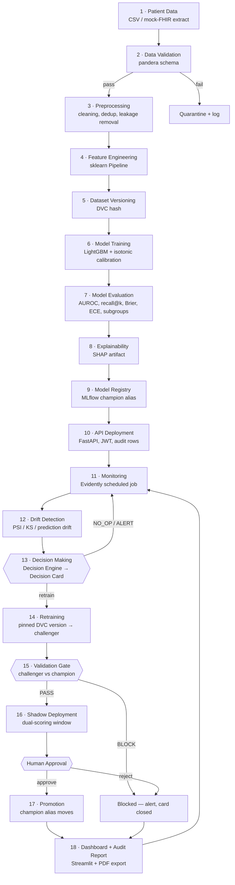
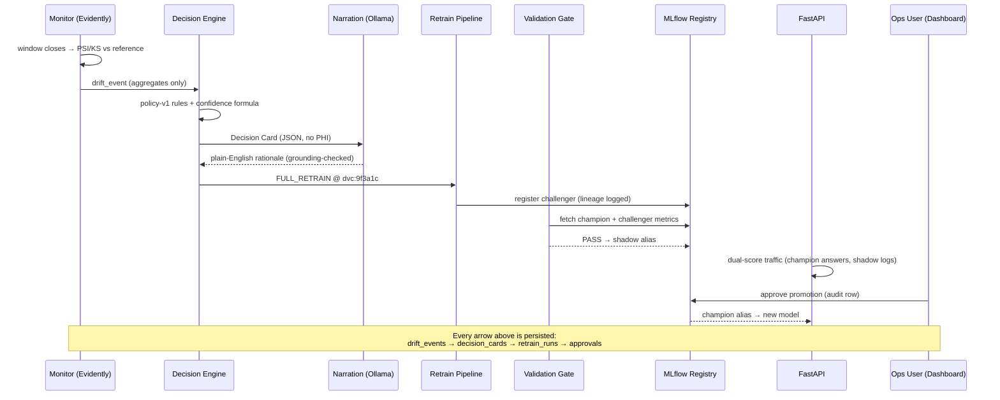

# VitalLoop 2.0 — End-to-End Workflow

> Companion documents: [ARCHITECTURE.md](ARCHITECTURE.md) · [PROJECT_DESIGN.md](PROJECT_DESIGN.md)

The workflow below is the complete lifecycle, from raw patient data to the audit report, exactly as the system executes it. Each numbered step names the component that owns it.

---

## 1. Master Flow

---

## 2. Step-by-Step

| # | Step | Owner | What happens | Key output |
|---|---|---|---|---|
| 1 | **Patient data** | Ingestion script | UCI Diabetes 130-US CSV lands as a mock EHR extract; optional mock-FHIR endpoint demonstrates integration shape | Raw batch |
| 2 | **Data validation** | pandera | Types, ranges, categorical domains, null ceilings. Failures quarantine the batch | Validated batch or quarantine record |
| 3 | **Preprocessing** | Feature pipeline | Deduplication (one encounter per patient), leakage removal (death/hospice discharge codes), missing-value strategy | Clean dataframe |
| 4 | **Feature engineering** | sklearn Pipeline | Encoding, ICD-9 chapter grouping, utilization counts, medication-change flags — one pipeline for train and serve | Feature matrix |
| 5 | **Dataset versioning** | DVC | `dvc add` produces the content hash that every downstream artifact references | `dvc:<hash>` |
| 6 | **Model training** | Training pipeline | LightGBM + isotonic calibration; params, data hash, git commit logged to MLflow | MLflow run |
| 7 | **Model evaluation** | Training pipeline | AUROC, AUPRC, recall@top-decile, Brier, ECE — overall and per subgroup (age/gender/race) | Metric set |
| 8 | **Explainability** | SHAP | TreeExplainer fitted and stored with the model; global summary + per-prediction top-3 | SHAP artifact |
| 9 | **Model registry** | MLflow | First model registered and given the `champion` alias | Registered version |
| 10 | **API deployment** | FastAPI | `/predict` serves calibrated risk + SHAP factors; JWT auth; every request writes an audit row (input hash, model + data version, score, timestamp) | Live endpoint |
| 11 | **Monitoring** | Monitor worker | Scheduled Evidently run over the rolling prediction window vs training reference | Drift report |
| 12 | **Drift detection** | Evidently | Per-feature PSI/KS, prediction-score drift; delayed-label performance when 30-day labels mature | `drift_events` row |
| 13 | **Decision making** | **Decision Engine** | Deterministic policy maps drift evidence → action (`NO_OP` / `ALERT_ONLY` / `INCREMENTAL_RETRAIN` / `FULL_RETRAIN`), confidence, disposition. Emits the **Decision Card**; LLM narration attached afterwards | Decision Card |
| 14 | **Retraining** | Retrain pipeline | Same training code, DVC hash pinned by the card; result registered as `challenger` | Challenger run |
| 15 | **Validation** | Validation Gate | Non-inferiority on AUROC/recall, calibration ceiling, subgroup non-regression. Pure function → PASS/BLOCK | Gate result |
| 16 | **Shadow deployment** | Serving middleware | Challenger dual-scores live traffic; agreement/stability stats accumulate; clinicians still see only champion | Shadow stats |
| 17 | **Deployment (promotion)** | Human + registry | Ops user approves in the dashboard; `champion` alias moves; approval row written | New champion |
| 18 | **Dashboard + audit report** | Streamlit | All of the above visible live; one click renders the CMS-style audit PDF for any Decision Card | Audit PDF |

---

## 3. The Self-Healing Loop as a Sequence

---

## 4. Failure Paths (designed, not incidental)

| Scenario | System behaviour |
|---|---|
| Drift below thresholds | `NO_OP` card — silence is also a logged, auditable decision |
| Noisy single-feature blip | `ALERT_ONLY`; persistence rule requires 2 consecutive windows before retraining |
| Challenger worse than champion | Gate **BLOCK** — card closed as `BLOCKED`, alert raised, serving untouched. *This is the demo's money shot.* |
| Ollama down | Jinja2 template narrative; loop proceeds identically |
| Ambiguous evidence (confidence < 0.75) | Disposition = `ESCALATE_HUMAN`; nothing retrains until an ops user acts |
| Performance regression on matured labels | Always escalates — performance drops are never auto-handled silently |

---

## 5. Demo Script (3 minutes)

1. Dashboard shows healthy champion; predictions flowing, each stamped with model + data version.
2. **Inject drift** (one button: scripted covariate shift on `num_lab_procedures` + `num_medications`).
3. Monitor fires → Decision Card renders: `FULL_RETRAIN`, confidence 0.86, auto-proceed → narrative panel explains why in plain English.
4. Retrain replays a cached run → challenger appears → **gate PASS** → shadow.
5. Approve promotion in the dashboard → champion version changes live.
6. Re-run with the deliberately bad challenger → **gate BLOCK** → export the audit PDF for the blocked card.
